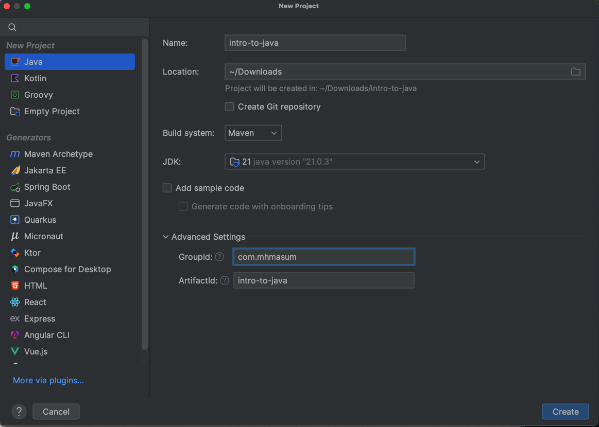
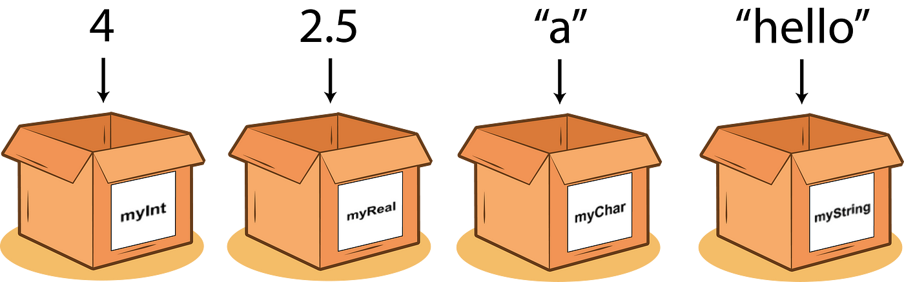
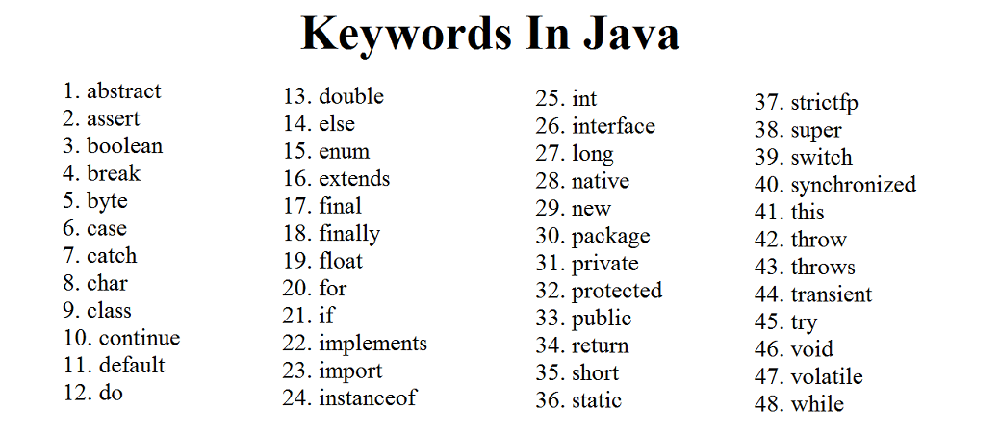
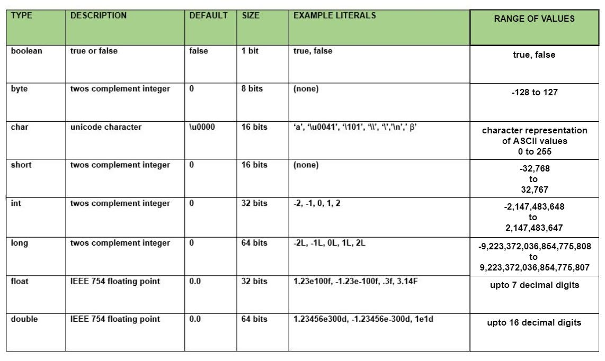
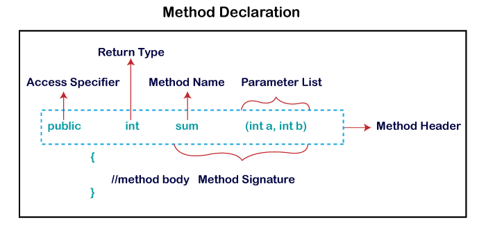

---
# You can also start simply with 'default'
theme: seriph
background: https://cover.sli.dev
title: Welcome to QAJune2024 Automation with java
info: |
  ## Presentation slides for QAJune2024 Automation with java
exportFilename: introduction-to-java
drawings:
  persist: false
transition: slide-left
mdc: true
hideInToc: true
addons:
  - ../addons/mhmasum0
---
# Introduction to Java

---
src: ../../pages/common/about-me.md
---

---
src: ../../pages/common/toc.md
---

---
layout: center
---
# How to learn effectively
- 📝 **Notes**: Take notes while learning
- **Practice**: Practice what you learn
- **Promodoro**: Use the Pomodoro technique

---
layout: default
---
# Setting up the environment

- Java: Install Java JDK<br>
  Download JDK(21) from [here](https://www.oracle.com/java/technologies/downloads/#java21)

- IDE: Install IntelliJ Community Edition<br>
  Download IntelliJ IDEA Community Edition from [here](https://www.jetbrains.com/idea/download/)

<br>
---
layout: two-cols-header
class: px-0
---

# Initialising a Java Maven project
Steps to initialise a Java Maven project

::left::
- Open IntelliJ IDEA CE
- Click on `New Project`
- Select `Java` from the left pane
- Click `Create`

::right::


---
layout: default
---
# Welcome to Java

````md magic-move
```java
public class ExampleJava {
}
```
```java
public class ExampleJava {
    public static void main(String[] args) {
    }
}
```
```java
public class ExampleJava {
    public static void main(String[] args) {
        System.out.println("Hello, World!");
    }
}
```
````
---
layout: default
---
# Variables in Java
<br>

#### _Definition:_
- A variable is a container that holds a value.<br>
- Java Documentation: [Variables](https://docs.oracle.com/javase/tutorial/java/nutsandbolts/variables.html)
  

---
layout: default
---
# Rules for naming variables
- Variable names are case-sensitive
- Variable names can contain letters, digits, and the underscore character
- Variable names cannot start with a digit or contain spaces
- Variable names must not be a reserved keyword
- Variable names should be meaningful

---
layout: default
---
# Java Reserved Keywords
<br>



---
layout: default
---
# Java Variable Naming Conventions

- Variable names should start with a lowercase letter
- Variable names should be in camelCase format. For example, `firstName`, `lastName`

### Other conventions
- PascalCase: `FirstName`, `LastName`
- snake_case: `first_name`, `last_name`
- kebab-case: `first-name`, `last-name`
- UPPER_CASE: `FIRST_NAME`, `LAST_NAME`

---
layout: default
---
# Data Types in Java
- **_Definition:_** A data type is a classification of data.
- **_Java Documentation:_** [Data Types](https://docs.oracle.com/javase/tutorial/java/nutsandbolts/datatypes.html)
- **_Article:_** [Java Data Types](https://www.shiksha.com/online-courses/articles/data-types-in-java-primitive-and-non-primitive-data-types/)
### Primitive Data Types in Java
- Definition: Primitive data types specify the size and type of variable values.
- Examples: `int`, `float`, `double`, `char`, `boolean` etc.
```java
int age = 25;
char c = 'A';
```

## Non-Primitive Data Types/Reference Data Types in Java
- Definition: Reference data types are used to store the reference/address of variables.
- Examples: `String`, `Array`, `Class`, `Interface` etc.
```java
String name = "John";
```

---
layout: default
---
# Data Types Default Values

[//]: # (![Data Types Default Values]&#40;./images/data-types-default-values.png&#41;)


---
layout: default
---
# Methods in Java
- **_Definition:_** A method is a block of code that performs a specific task.
- **_Java Documentation:_** [Methods](https://docs.oracle.com/javase/tutorial/java/javaOO/methods.html)
## Benefits of using methods
- Reusability
- Modularity

---
layout: default
---
# Types of Methods in Java
- **_Definition:_** Methods in Java are classified into two types:
  - Built-in methods
  - User-defined methods
## Built-in Methods
- **_Definition:_** Built-in methods are methods that are provided by Java.
- **_Examples:_** `println()`, `nextLine()`, `next()`, `nextInt()`, `nextDouble()`
- **_Java Documentation:_** [Built-in Methods](https://docs.oracle.com/javase/8/docs/api/java/lang/System.html)
## User-defined Methods
- **_Definition:_** User-defined methods are methods that are created by the user.

---
layout: default
---
# Java Method Declaration
<br>



---
layout: default
---
# Java Method Code Example
```java
public class Addition   
{  
    public static void main(String[] args)
    {  
        int a = 19;  
        int b = 5;
        //method calling  
        int c = add(a, b);   //a and b are actual parameters  
        System.out.println("The sum of a and b is= " + c);
    }  
    //user defined method  
    public static int add(int n1, int n2)   //n1 and n2 are formal parameters  
    {  
      int s;  
      s=n1+n2;  
      return s; //returning the sum  
    }  
}  
```

---
src: ../../pages/common/end.md
---