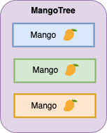
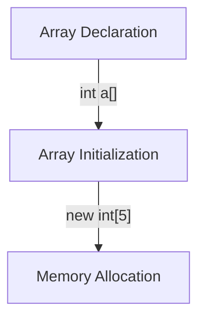
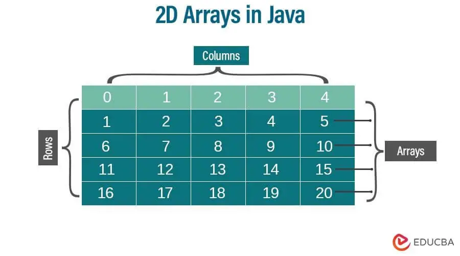

# Java Arrays

<div class="pt-12">
  <span @click="$slidev.nav.next" class="px-2 py-1 rounded cursor-pointer" hover="bg-white bg-opacity-10">
    Press Space for next page <carbon:arrow-right class="inline"/>
  </span>
</div>

<div class="abs-br m-6 flex gap-2">
  <a href="https://github.com/mhmasum0/qa-june-2024-automation-with-java-slides" target="_blank" alt="GitHub" title="Open in GitHub"
    class="text-xl slidev-icon-btn opacity-50 !border-none !hover:text-white">
    <carbon-logo-github />
  </a>
</div>

<!--
The last comment block of each slide will be treated as slide notes. It will be visible and editable in Presenter Mode along with the slide. [Read more in the docs](https://sli.dev/guide/syntax.html#notes)
-->

---
hideInToc: true
---

# Agenda
<Toc />

---
layout: two-cols

---
# Java Arrays
 
> An array is a collection of similar type of elements that have a contiguous memory location.

<ul v-motion-roll-visible-right>

<v-click><li v-motion-roll-left>An array is a collection of similar types of data</li></v-click>
<v-click><li>It is a fixed-size sequential collection of elements of the same type</li></v-click>
<v-click><li>It is a data structure where we store similar elements</li></v-click>

</ul>

Learn more about [Java Arrays](https://docs.oracle.com/javase/tutorial/java/nutsandbolts/arrays.html)

::right::

<iframe src="https://giphy.com/embed/QfGYYVrbay6kssMrYn" width="300" style="" frameBorder="0" class="giphy-embed" allowFullScreen></iframe>

<style>

.slidev-vclick-target {
  transition: all 500ms ease;
}

.slidev-vclick-hidden {
  transform: scale(0);
}
</style>

---
layout: center
hideInToc: true
transition: slide-up
---

# MangoTree

<div class="w-full text-center">

<div v-click="[0, 3]" v-motion
  :initial="{ x: -50 }"
  :enter="{ x: 0 }"
  :leave="{ x: 50 }"
>
  
</div>

</div>

<div v-click="[1, 3]" v-motion
  :initial="{ x: -50 }"
  :enter="{ x: 0 }"
  :leave="{ x: 50 }"
>
  
</div>

<div v-click="[2, 3]" v-motion
  :initial="{ x: -50 }"
  :enter="{ x: 0 }"
  :leave="{ x: 50 }"
>
  
</div>

<div v-click="3" v-motion
  :initial="{ x: 0, y: 100 }"
  :enter="{ x: 0, y: -100 }"
  :leave="{ x: 50 }"
>
  
</div>


---
layout: center
---
# Arrays Memory Allocation
> Memory allocation for arrays is done in a continuous block of memory.

<br>


<style>
h1 {
  background-color: #2B90B6;
  background-image: linear-gradient(45deg, #4EC5D4 10%, #146b8c 20%);
  background-size: 100%;
  -webkit-background-clip: text;
  -moz-background-clip: text;
  -webkit-text-fill-color: transparent;
  -moz-text-fill-color: transparent;
}
img{
  width: 75%;
  padding-left: 15px;
}
</style>

---
layout: center
---
# Types of Arrays

- Single Dimensional Array
- Multi-Dimensional Array

---
layout: default
---
# Declaring an Array

<v-clicks>

- `dataType[] arr;`
- `dataType arr[];`
- `dataType arr[];`
</v-clicks>
<v-click>
  <B> Suggested: </B> dataType[] arr;
</v-click>

# Instantiation of an Array in Java
<v-clicks>

- `dataType[] arr = new datatype[size];`
- `int[] intArray = {48,5,4,5};`  <B>declaration, instantiation and initialization</B>

</v-clicks>


---
layout: two-cols
---
# Code Example of Java Array

```java
class JavaArrayExample {
    public static void main(String[] args) {
        int[] intArray = new int[5];
        intArray[0] = 10;
        intArray[1] = 20;
        intArray[2] = 30;
        intArray[3] = 40;
        intArray[4] = 50;
        for (int i = 0; i < intArray.length; i++) {
            System.out.println(intArray[i]);
        }
    }
}
```

::right::



---
layout: default
---
# Code Example of Returning Array from Method

```java
class JavaArrayExample {
    public static void main(String[] args) {
        int[] intArray = getArray();
        for (int i = 0; i < intArray.length; i++) {
            System.out.println(intArray[i]);
        }
    }

    public static int[] getArray() {
        int[] intArray = new int[5];
        intArray[0] = 10;
        intArray[1] = 20;
        intArray[2] = 30;
        intArray[3] = 40;
        intArray[4] = 50;
        return intArray;
    }
}
```

---
layout: default
---
# Java ArrayIndexOutOfBoundsException

> An ArrayIndexOutOfBoundsException is thrown when you try to access an array element with an index that is either less than zero or greater than or equal to the length of the array.

```java
class JavaArrayExample {
    public static void main(String[] args) {
        int[] intArray = new int[5];
        intArray[5] = 10;
    }
}
```

---
layout: two-cols
---
# Code Example of Multi-Dimensional Array

```java
class JavaArrayExample {
    public static void main(String[] args) {
        int[][] intArray = new int[2][3];
        intArray[0][0] = 10;
        intArray[0][1] = 20;
        intArray[0][2] = 30;
        intArray[1][0] = 40;
        intArray[1][1] = 50;
        intArray[1][2] = 60;
        for (int i = 0; i < intArray.length; i++) {
            for (int j = 0; j < intArray[i].length; j++) {
                System.out.println(intArray[i][j]);
            }
        }
    }
}
```

::right::




---
src: ../../pages/common/end.md
---
