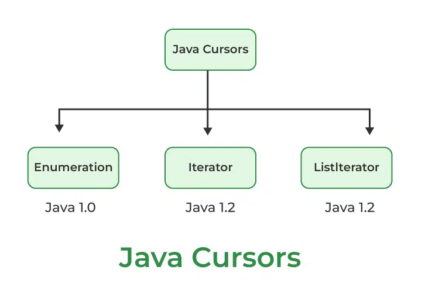

# Java Collection Example

<div class="pt-12">
  <span @click="$slidev.nav.next" class="px-2 py-1 rounded cursor-pointer" hover="bg-white bg-opacity-10">
    Press Space for next page <carbon:arrow-right class="inline"/>
  </span>
</div>

<div class="abs-br m-6 flex gap-2">
  <a href="https://github.com/mhmasum0/qa-june-2024-automation-with-java-slides" target="_blank" alt="GitHub" title="Open in GitHub"
    class="text-xl slidev-icon-btn opacity-50 !border-none !hover:text-white">
    <carbon-logo-github />
  </a>
</div>

<!--
The last comment block of each slide will be treated as slide notes. It will be visible and editable in Presenter Mode along with the slide. [Read more in the docs](https://sli.dev/guide/syntax.html#notes)
-->

---
hideInToc: true
---

# Agenda
<Toc />

---
layout: center
---

# Important methods of Collection Interface

| Method                              | Description                                                             |
|-------------------------------------|-------------------------------------------------------------------------|
| `boolean add(Object o)`             | Adds the specified element to the collection.                           |
| `boolean contains(Object o)`        | Checks if the collection contains the specified element.                |
| `boolean addAll(Collection c)`      | Adds all elements from the specified collection to this one.            |
| `boolean containsAll(Collection c)` | Checks if the collection contains all elements from another collection. |
| `boolean remove(Object o)`          | Removes the specified element from the collection.                      |

---
layout: center
---

# More methods of Collection Interface

| Method                            | Description                                                                            |
|-----------------------------------|----------------------------------------------------------------------------------------|
| `boolean isEmpty()`               | Checks if the collection is empty.                                                     |
| `boolean removeAll(Collection c)` | Removes all elements from the collection that are contained in another collection.     |
| `int size()`                      | Returns the number of elements in the collection.                                      |
| `boolean retainAll(Collection c)` | Retains only the elements in this collection that are contained in another collection. |
| `Object[] toArray()`              | Returns an array containing all of the elements in the collection.                     |
| `void clear()`                    | Removes all elements from the collection.                                              |

---
layout: center
---

# ArrayList

- The underlined data structure Resizable Array or Growable Array
- Duplicates are allowed.
- Insertion order is preserved.
- Heterogeneous objects are allowed [except TreeSet & TreeMap everywhere heterogeneous objects are allowed].
- Null insertion is possible.

<br>

<C>ArrayList Constructors</C>
1. `ArrayList al = new ArrayList();`
2. `ArrayList al = new ArrayList(int initialCapacity);`
3. `ArrayList al = new ArrayList(Collection c);`

---
layout: center
---

# ArrayList Code Example

```java
import java.util.ArrayList;

public class ArrayListExample {
    public static void main(String[] args) {
        ArrayList<String> programmingLanguages = new ArrayList<>();
        programmingLanguages.add("Java");
        programmingLanguages.add("Python");
        programmingLanguages.add("JavaScript");
        programmingLanguages.add("C#");
        programmingLanguages.add("Ruby");

        System.out.println(programmingLanguages);
        
        ArrayList<Object> mixedList = new ArrayList<>(programmingLanguages);
        mixedList.add("Java");
        mixedList.add(10);
        mixedList.add(10.5);
        mixedList.add(true);
        mixedList.add(null);
        
        mixedList.remove(10.5);
        
        System.out.println(mixedList);
    }
}
```
---
layout: center
---

# LinkedList

- The underlying data structure is Double Linked List. 
- Insertion order is preserved.
- Duplicates are allowed.
- Heterogeneous Objects are allowed.
- Null insertion is possible.
- Linked List is the best choice if our requirement is <HL>insertion and deletion in the middle</HL>.
- Worst choice if our frequent operation is <HL className="text-orange-400 bg-orange-100 p-1">retrieval of data</HL>.

<br>

<C>ArrayList Constructors</C>
1. `LinkedList l1 = new LinkedList();`
2. `LinkedList l2 = new LinkedList(Collection c);`

---
layout: center
zoom: 0.9
---

# LinkedList Code Example

```java
import java.util.LinkedList;

public class LinkedListExample {
    public static void main(String[] args) {
        LinkedList<String> programmingLanguages = new LinkedList<>();
        programmingLanguages.add("Java");
        programmingLanguages.add("Python");
        programmingLanguages.add("JavaScript");
        programmingLanguages.add("C#");
        programmingLanguages.add("Ruby");

        System.out.println(programmingLanguages);
        
        LinkedList<Object> mixedList = new LinkedList<>(programmingLanguages);
        mixedList.add("Java");
        mixedList.add(10);
        mixedList.add(10.5);
        mixedList.add(true);
        mixedList.add(null);
        
        mixedList.remove(10.5);

        System.out.println(mixedList.getFirst());
        System.out.println(mixedList.getLast());
        System.out.println(mixedList.get(2));
        System.out.println(mixedList);
    }
}
```
---
layout: center
---

# HashSet

- The underlying data structure is Hashtable.
- <HL>Duplicates are not allowed</HL>. If we are trying to insert duplicates, we won't get any compile time or runtime errors. add() method simply returns false.
- <HL>Insertion order is not preserved</HL> and all objects will be inserted based on  hash-code of objects.
- Heterogeneous objects are allowed.
- Null insertion is possible.
- Implements Serializable and Clonable interfaces but not RandomAccess.
- HashSet is the best choice, if our frequent operation is Search operation.

---
layout: center
---

# HashSet Code Example

```java
import java.util.HashSet;
public class HashSetExample {
    public static void main(String[] args) {
        
        HashSet<Object> hashSet = new HashSet<>(); // Create a HashSet
        
        hashSet.add("Java");          // String
        hashSet.add(42);              // Integer
        hashSet.add(3.14);            // Double
        hashSet.add(null);            // Null value
        hashSet.add("HashSet");       // String
        
        boolean isAdded = hashSet.add("Java");  // Duplicates not allowed
        System.out.println("Was 'Java' added again? " + isAdded);  // Output: false

        System.out.println("HashSet elements: " + hashSet);

        boolean containsElement = hashSet.contains(42);
        System.out.println("Does HashSet contain '42'? " + containsElement);  // Output: true

        hashSet.remove(3.14);
        System.out.println("After removing 3.14: " + hashSet);

        System.out.println("Does HashSet contain 'HashSet'? " + hashSet.contains("HashSet"));  // Output: true
    }
}
```

---
layout: center
---

# Java Cursors

> in Java, cursors are a set of interfaces and classes that allow you to traverse or iterate through the elements of a collection. These cursors provide a way to access and manipulate the elements of a data structure, such as lists, sets, and maps, one at a time.

<center></center>

---
layout: center
---

# Enumeration
Available methods:
- `boolean hasMoreElements()` `Object nextElement()`

Create an Enumeration object by calling the elements() method of the Vector class.

```java
import java.util.Enumeration;
import java.util.Vector;

public class EnumerationExample {
    public static void main(String[] args) {
        Vector<String> vector = new Vector<>();
        vector.add("Java");
        vector.add("Python");
        vector.add("JavaScript");
        vector.add("C#");
        vector.add("Ruby");

        Enumeration<String> enumeration = vector.elements();
        while (enumeration.hasMoreElements()) {
            System.out.println(enumeration.nextElement());
        }
    }
}
```

---
layout: center
zoom: 0.85
---

# Iterator

Available methods:
- `boolean hasNext()` `Object next()` `void remove()`

Create an Iterator object by calling the iterator() method of the Collection interface.

```java
import java.util.ArrayList;
import java.util.Iterator;

public class IteratorExample {
    public static void main(String[] args) {
        ArrayList<String> programmingLanguages = new ArrayList<>();
        programmingLanguages.add("Java");
        programmingLanguages.add("Python");
        programmingLanguages.add("JavaScript");
        programmingLanguages.add("C#");
        programmingLanguages.add("Ruby");

        Iterator<String> iterator = programmingLanguages.iterator();
        while (iterator.hasNext()) {
            // if python remove it else print all the available programming languages
            String language = iterator.next();
            if (language == "Python" ) {
                iterator.remove();
            } else {
                System.out.println(language);
            }
        }
    }
}
```

---
layout: center
zoom: 0.85
---

# ListIterator

Available methods:
- `boolean hasNext()` `Object next()` `boolean hasPrevious()` `Object previous()` `void remove()` `void add(Object o)` `void set(Object o)`

Create a ListIterator object by calling the listIterator() method of the List interface.

```java
import java.util.LinkedList;
import java.util.ListIterator;

public class ListIteratorExample {
    public static void main(String[] args) {
        LinkedList<String> programmingLanguages = new LinkedList<>();
        programmingLanguages.add("Java");
        programmingLanguages.add("Python");
        programmingLanguages.add("JavaScript");
        programmingLanguages.add("C#");
        programmingLanguages.add("Ruby");

        ListIterator<String> listIterator = programmingLanguages.listIterator();
        while (listIterator.hasNext()) {
            String language = listIterator.next();
            if (language == "Python") {
                listIterator.remove();
            } else {
                System.out.println(language);
            }
        }
    }
}
```

---
src: ../../pages/common/end.md
---