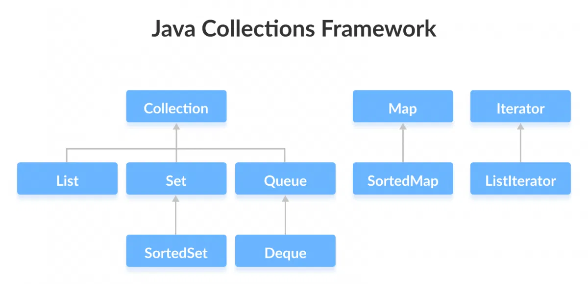
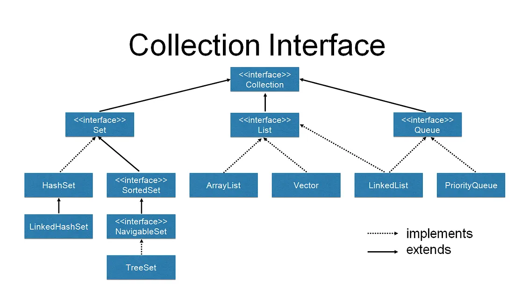
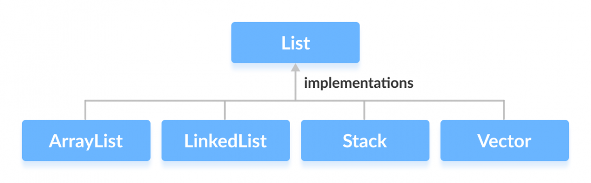
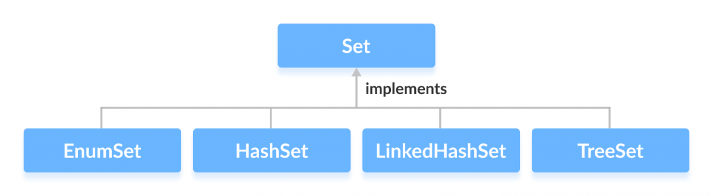

# Java Collection

<div class="pt-12">
  <span @click="$slidev.nav.next" class="px-2 py-1 rounded cursor-pointer" hover="bg-white bg-opacity-10">
    Press Space for next page <carbon:arrow-right class="inline"/>
  </span>
</div>

<div class="abs-br m-6 flex gap-2">
  <a href="https://github.com/mhmasum0/qa-june-2024-automation-with-java-slides" target="_blank" alt="GitHub" title="Open in GitHub"
    class="text-xl slidev-icon-btn opacity-50 !border-none !hover:text-white">
    <carbon-logo-github />
  </a>
</div>

<!--
The last comment block of each slide will be treated as slide notes. It will be visible and editable in Presenter Mode along with the slide. [Read more in the docs](https://sli.dev/guide/syntax.html#notes)
-->

---
hideInToc: true
---

# Agenda
<Toc />

---
layout: center
---

# Java Collections Framework

> The Java collections framework provides a set of interfaces and classes to implement various data structures and algorithms.



---
layout: default
---

# Limitations of Arrays

- Arrays are fixed in size i.e. once we created an array with some size there is no chance of increasing or decreasing its size based on our requirement. Hence to use arrays we should know the size in advance which may not possible always.
- Arrays can hold only homogeneous data elements. Example:
```java
Student []s =  new Student [10000];
s[0] = new Student; // correct
s[1] = new Customer(); // wrong
```

- But We can resolve this problem by using object Arrays.

```java
Object[] obj = new Object [10000];
obj [0] = new Student();
obj [1] = new Customer();
```

- Arrays are not built using any standard data structure, so they don't come with ready-to-use methods for common tasks like adding, removing, or sorting elements. You have to handle these things on your own or use other classes to help.

---
layout: center
---

#  Importance of collections

- Collections are growable in nature. i.e. Based on our requirement we can increase (or) Decrease the size.
- Collections can hold both <HL>homogeneous</HL> _(same type)_ & <HL>Heterogeneous</HL> _(different types)_ elements.
- Every Collection class is implemented based on some standard data structure. Hence readymade method support is available for every requirement. Being a programmer we have to use this method and we are not responsible to provide
  implementation.

---
layout: center
zoom: 0.9
---

# Array vs Collection

| Feature                   | Arrays                                                    | Collections                                                                         |
|---------------------------|-----------------------------------------------------------|-------------------------------------------------------------------------------------|
| Size                      | <HL className="text-rose-700">Fixed</HL>                  | <HL className="text-green-700">Growable</HL>                                        |
| Memory Recommendation     | <HL className="text-rose-700">Not Recommended</HL>        | <HL className="text-green-700">Recommended</HL>                                     |
| Performance               | <HL className="text-green-700"> Recommended</HL>          | <HL className="text-rose-700">Not Recommended</HL>                                  |
| Element Types             | <HL className="text-rose-700">Homogeneous</HL>            | <HL className="text-green-700">Homogeneous and Heterogeneous</HL>                   |
| Underlying Data Structure | <HL className="text-rose-700">None</HL>                   | <HL className="text-green-700">Standard Data Structures (e.g., List, Set, Map)</HL> |
| Readymade Method Support  | <HL className="text-rose-700">Limited</HL>                | <HL className="text-green-700">Comprehensive</HL>                                   |
| Supported Data Types      | <HL className="text-green-700">Primitive and Objects</HL> | <HL className="text-rose-700">Only Objects</HL>                                     |

---
layout: center
---

# Difference between Collection & Collections

- <HL className="text-green-400 bg-zinc-600 p-1" >Collection</HL> is an <HL className="text-green-400">interface</HL> which can be used to represent a group of individual objects as a single entity.

Example: List, Set, Queue, Deque
```java
List<String> studentNames = new ArrayList<>();
studentNames.add("Alice");
studentNames.add("Bob");
```

- <HL className="text-amber-400 bg-stone-600 p-1" >Collections</HL> is an <HL className="text-amber-400">utility class</HL> present in java.util.package to define several utility methods (like Sorting, Searching..) for Collection objects.

Example: If you have a collection (like a list of numbers) and want to sort it or search for an item, you can use the Collections class to do this without writing the logic yourself.
```java
List<Integer> numbers = Arrays.asList(3, 1, 4, 2);
Collections.sort(numbers);  // Sorts the list in ascending order
System.out.println(numbers); // Output: [1, 2, 3, 4]
```

---
layout: center
---

# Collection Framework Hierarchy

<Transform :scale="1.25" origin="center top">
  
</Transform>

---
layout: center
---

# Key Interfaces of Collection Framework

1. Collection
2. List
3. Set
4. SortedSet
5. NavigableSet
6. Queue
7. Map

---
layout: center
---

# Collection Interface

- If we want to represent a group of individual objects as a single entity then we should go for Collection.
- Collection interface defines the most common methods which are applicable for any Collection object.
- Collection interface is considered as the root interface of the Collection framework.

<br>

> There is no concrete class which implements collection interface directly.

```java
Collection<String> myCollection = new ArrayList<>();
myCollection.add("Apple");
myCollection.add("Banana");
System.out.println(myCollection.size());
```

---
layout: center
---

# List Interface

- List is child interface of Collection. 
- If we want to represent a group of individual objects as a single entity where <HL>duplicates are allowed</HL> and <HL>insertion order</HL>
  preserved then we should go for List.

```java
List<String> myList = new ArrayList<>();
myList.add("Apple");
myList.add("Banana");
myList.add("Apple");  // Duplicates are allowed
```



Learn more: [Java List](https://www.programiz.com/java-programming/list)

---
layout: center
---

# Set Interface

- It is the child interface of Collection.
- If we want to represent a group of individual objects as a single entity where <HL>duplicates are not allowed</HL> and <HL>insertion order not preserved</HL> then we should go for Set.

```java
Set<String> mySet = new HashSet<>();
mySet.add("Apple");
mySet.add("Banana");
mySet.add("Apple");  // Duplicate element
System.out.println(mySet); // Output: [Apple, Banana]
```



---
layout: center
---

# SortedSet Interface

- It is the child interface of Set.
- If we want to represent a group of individual objects as a single entity where <HL>duplicates are not allowed</HL> , <HL>insertion order is not preserved</HL> but all objects <HL>should be inserted according to some sorting order</HL> then we should go for SortedSet.

```java
SortedSet<Integer> numbers = new TreeSet<>();
numbers.add(3);
numbers.add(1);
numbers.add(2);
System.out.println(numbers);  // Output: [1, 2, 3]
```

```java
SortedSet<Integer> treeSetDesc = new TreeSet<>(Collections.reverseOrder());
treeSetDesc.add(5);
treeSetDesc.add(2);
treeSetDesc.add(7);
System.out.println(treeSetDesc);  // Output: [7, 5, 2]
```

---
layout: center
---

# NavigableSet Interface

- It is the child interface of Sorted Set
- It defines several methods for navigation purposes.

```java
NavigableSet<Integer> set = new TreeSet<>();
set.add(10);
set.add(20);
set.add(30);
System.out.println(set.lower(25));  // Output: 20
System.out.println(set.floor(20));  // Output: 20
```

---
layout: center
---

# Queue Interface

- It is child interface of Collection.
- If we want to represent a group of individual objects prior to processing then we should go for Queue.


> Ex: before sending a mail all mail id's we have to store somewhere and in which order we saved in the same order mail's should be delivered <HL>(First in First out)</HL> for this requirement Queue concept is the best choice.

```java
Queue<String> queue = new LinkedList<>();
queue.add("A");
queue.add("B");
queue.add("C");
System.out.println(queue.poll());  // Output: A (first added, first removed)
queue.offer("D");  // Adds "D" to the end of the queue
```

---
layout: center
---

# Map Interface

- Map is not the child interface of Collection.
- If we want to represent a group of individual objects as <HL>key-value pairs</HL> then should go for Map.
  > Ex: Roll No Name<br>
  101 →	Lamia<br>
  102 →	Sudipto<br>
  103 →	Abir<br>
  104→	Sudipto
  
- Both key and value are objects, <HL>duplicated keys are not allowed</HL> but <HL>values can be duplicated</HL>.

```java
Map<Integer, String> myMap = new HashMap<>();
myMap.put(101, "Lamia");
myMap.put(102, "Sudipto");
myMap.put(103, "Abir");
myMap.put(104, "Sudipto");
System.out.println(studentMap.get(101)); // Output: Lamia
```

---
src: ../../pages/common/end.md
---