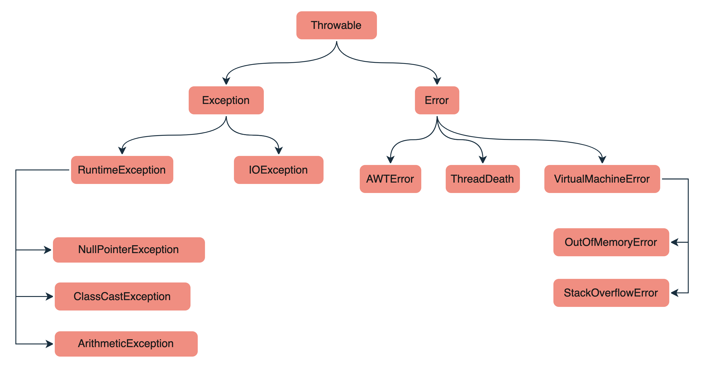

# Java Exception

<div class="pt-12">
  <span @click="$slidev.nav.next" class="px-2 py-1 rounded cursor-pointer" hover="bg-white bg-opacity-10">
    Press Space for next page <carbon:arrow-right class="inline"/>
  </span>
</div>

<div class="abs-br m-6 flex gap-2">
  <a href="https://github.com/mhmasum0/qa-june-2024-automation-with-java-slides" target="_blank" alt="GitHub" title="Open in GitHub"
    class="text-xl slidev-icon-btn opacity-50 !border-none !hover:text-white">
    <carbon-logo-github />
  </a>
</div>

<!--
The last comment block of each slide will be treated as slide notes. It will be visible and editable in Presenter Mode along with the slide. [Read more in the docs](https://sli.dev/guide/syntax.html#notes)
-->

---
hideInToc: true
---

# Agenda
<Toc />

---
layout: center
---

# What is Exception?

- Error events that can occur during the execution of a program and disrupt the normal flow of instructions are called exceptions.
- When an exceptional situation occurs, an object of the Exception class or one of its subclasses is created and thrown.
- If this exception is not caught and handled properly, it will terminate the normal flow of the program and print an error message on the console.

<br>

> The core advantage of exception handling is to maintain the normal flow of the application.


---
layout: two-cols
---
# Java try block

- Java try block is used to enclose the code that might throw an exception. It must be used within the method.
- If an exception occurs at the particular statement in the try block, the rest of the block code will not execute. <HL>So, it is recommended not to keep the code in try block that will not throw an exception.</HL>
- Java try block must be followed by either catch or finally block.

::right::
```java
try {
    // code that might throw an exception
}
catch and finally blocks...
```

---
layout: two-cols
---

# Java catch block

- Java catch block is used to handle the Exception by declaring the type of exception within the parameter. The declared exception must be the parent class exception ( i.e., Exception) or the generated exception type. However, the good approach is to declare the generated type of exception.
- The catch block must be used after the try block only. <HL>You can use multiple catch block with a single try block.</HL>

::right::

```java
public class Main {
    public static void main(String[] args) {
        try {
            int[] numbers = {1, 2, 3};
            System.out.println(numbers[10]);
        } catch (ArrayIndexOutOfBoundsException e) {
            System.out.println("Array index out of bound exception");
        }
    }
}
```

---
layout: two-cols
---

# Java Multiple catch block

> A try block can be followed by one or more catch blocks. Each catch block must contain a different exception handler.
<HL>So, if you have to perform different tasks at the occurrence of different exceptions, use java multi-catch block.</HL>

**Points to remember:**<br>

- At a time only one exception occurs and at a time only one catch block is executed.
- All catch blocks must be ordered from <HL>most specific to most general</HL>, i.e. catch for ArithmeticException must come before catch for Exception.

::right::

```java
public class Main {
    public static void main(String[] args) {
        try {
            int[] numbers = {1, 2, 3};
            System.out.println(numbers[10]);
        } catch (ArrayIndexOutOfBoundsException e) {
            System.out.println("Array index out of bound exception");
        } catch (Exception e) {
            System.out.println("Parent exception occurred");
        }
    }
}
```

---
layout: two-cols
---

# Java finally block

- Java finally block is a block used to execute important code such as closing the connection, etc.
- Java <HL>finally block is always executed whether an exception is handled or not</HL>. Therefore, it contains all the necessary statements that need to be printed regardless of the exception occurs or not.
- The finally block <HL>follows the try-catch block</HL>.

::right::

```java
public class Main {
    public static void main(String[] args) {
        try {
            int[] numbers = {1, 2, 3};
            System.out.println(numbers[10]);
        } catch (ArrayIndexOutOfBoundsException e) {
            System.out.println("Array index out of bound exception");
        } finally {
            System.out.println("Finally block is always executed");
        }
    }
}
```

---
layout: center
---

# Java Exception Hierarchy



---
layout: default
---

# Types of Exception

- **Checked Exception**
  - The classes that directly inherit the Throwable class except RuntimeException and Error are known as checked exceptions.
  - Example: `IOException`, `SQLException`, etc.
- **Unchecked Exception**
  - The classes that inherit the RuntimeException are known as unchecked exceptions.
  - Unchecked exceptions are not checked at compile-time, but they are checked at runtime.
  - Example: `ArithmeticException`, `NullPointerException`, `ArrayIndexOutOfBoundsException` , etc.
- **Error**
  - Error is irrecoverable. Some example of errors are OutOfMemoryError, VirtualMachineError, AssertionError etc.

---
layout: center
---

# Java Exception Declaration

> Tells the Java compiler that a method might throw an exception.
- The throws keyword is used in a method signature to declare the types of checked exceptions that the method may throw. This is required for <HL>checked exceptions because the compiler needs to know which exceptions might be thrown</HL> so that it can enforce proper exception handling.


```java
public void method() throws IOException {
    // code
}
```

```java
import java.io.FileReader;
import java.io.IOException;

public class FileOperations {
    // Declares that this method might throw an IOException
    public void readFile(String fileName) throws IOException {
        FileReader file = new FileReader(fileName);  // IOException may occur
        System.out.println("File opened successfully.");
    }
}
```


---
layout: center
---

# Java Throwing Exception

> The throw keyword is <HL>used to explicitly throw an exception</HL>. This is useful when you want to create your own custom exceptions or when you want to throw an exception based on certain conditions.

```java
throw new ArithmeticException("Arithmetic Exception");
```

```java
// Custom exception class
public class InvalidAgeException extends Exception {
  public InvalidAgeException(String message) {
    super(message);  // Passes the message to the Exception class constructor
  }
}

public class AgeValidator {
  // Method to validate age, throws InvalidAgeException if age is invalid
  public void validate(int age) throws InvalidAgeException {
    if (age < 18) {
      throw new InvalidAgeException("Age is not valid. Must be 18 or older.");
    }
    System.out.println("Age is valid.");
  }

  public static void main(String[] args) {
    AgeValidator validator = new AgeValidator();
    try {
      validator.validate(16);  // This will throw InvalidAgeException
    } catch (InvalidAgeException e) {
      System.out.println("Error: " + e.getMessage());
    }
  }
}

```

---
src: ../../pages/common/end.md
---