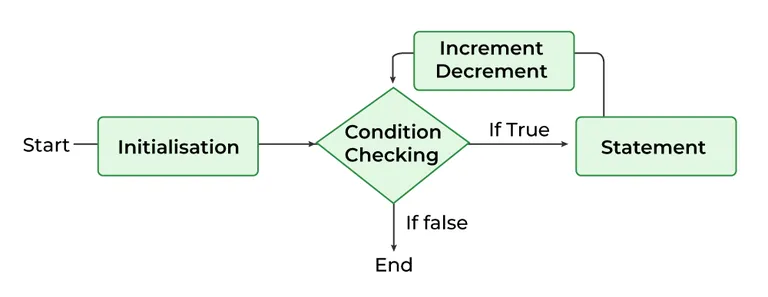
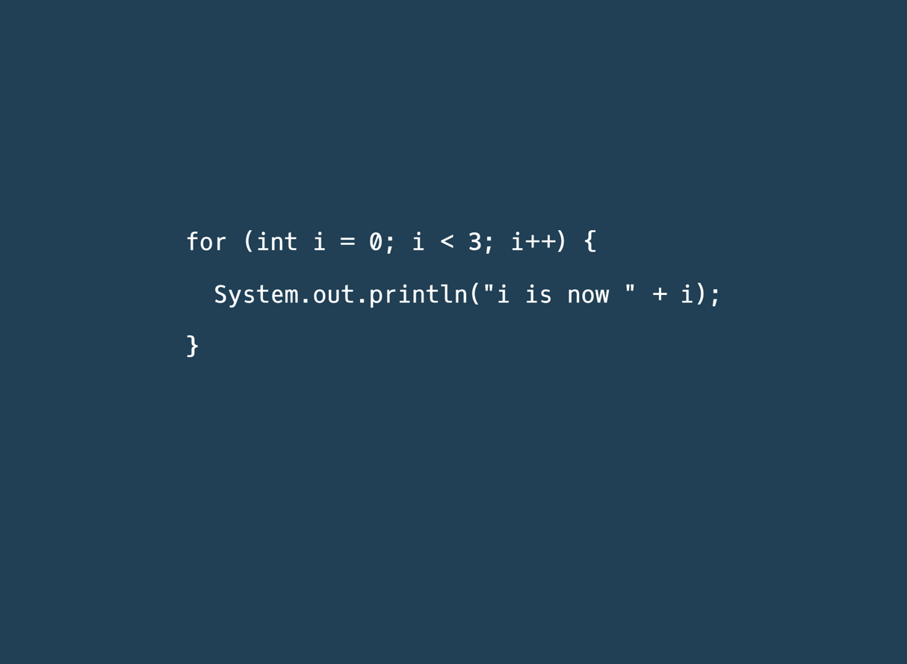
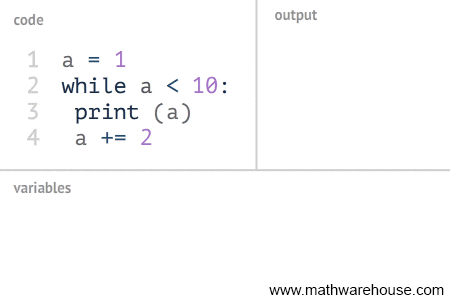
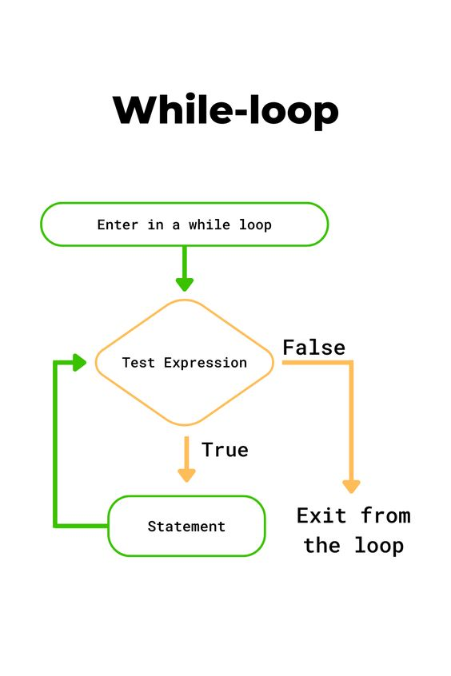
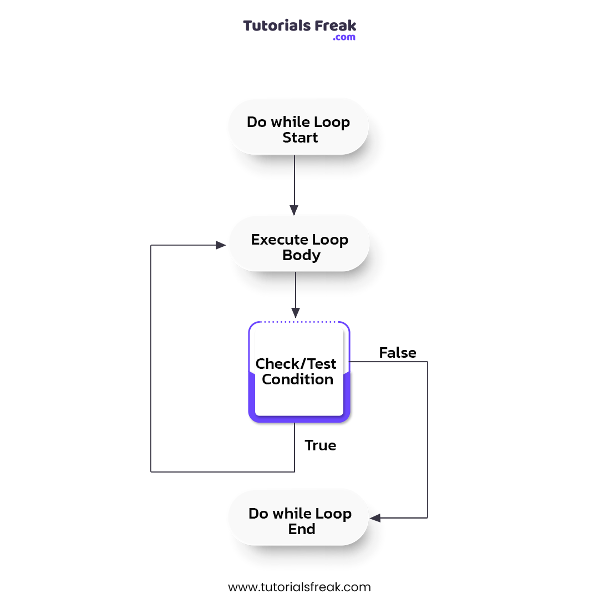
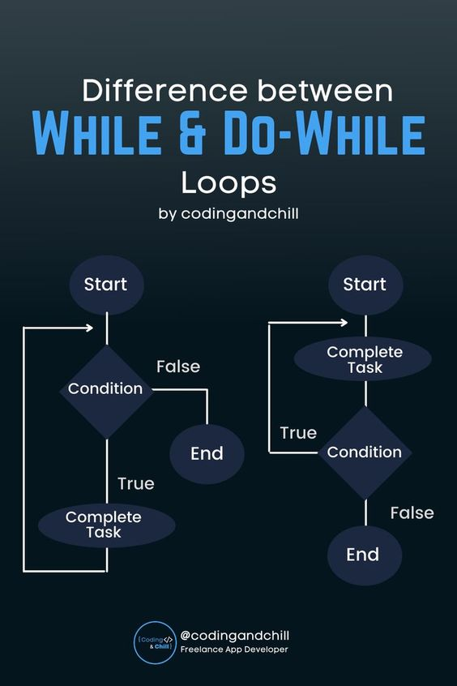

# Java Loops

<div class="pt-12">
  <span @click="$slidev.nav.next" class="px-2 py-1 rounded cursor-pointer" hover="bg-white bg-opacity-10">
    Press Space for next page <carbon:arrow-right class="inline"/>
  </span>
</div>

<div class="abs-br m-6 flex gap-2">
  <a href="https://github.com/mhmasum0/qa-june-2024-automation-with-java-slides" target="_blank" alt="GitHub" title="Open in GitHub"
    class="text-xl slidev-icon-btn opacity-50 !border-none !hover:text-white">
    <carbon-logo-github />
  </a>
</div>

<!--
The last comment block of each slide will be treated as slide notes. It will be visible and editable in Presenter Mode along with the slide. [Read more in the docs](https://sli.dev/guide/syntax.html#notes)
-->

---
hideInToc: true
---

# Agenda
<Toc />


---
layout: default
zoom: 1.1
---

# Loops?

> Loops are used to execute a set of statements repeatedly until some condition evaluates to false.


There are **three(3)** types of loops in Java:
- _For Loop_
- _While Loop_
- _Do-While Loop_

<style>
h1 {
  background-color: #2B90B6;
  background-image: linear-gradient(45deg, #4EC5D4 10%, #146b8c 20%);
  background-size: 100%;
  -webkit-background-clip: text;
  -moz-background-clip: text;
  -webkit-text-fill-color: transparent;
  -moz-text-fill-color: transparent;
}
</style>

<!--
Here is another comment.
-->

---
layout: two-cols
---

# For Loop
- **Initialization:** Start variable/value of the loop. It is executed only once.
- **Condition:** The loop continues until the condition is true.
- **Increment/Decrement:** Increases or decreases the value of the loop variable.
- **Statement:** The code block that is executed in each iteration.


::right::
<br>
<br>
<br>

```java
for (Initialization; Condition; Increment/Decrement) {
    // Inner code block
}
```



<style>
h1 {
  background-color: #9e33b5;
  background-image: linear-gradient(45deg, #d051d9 10%, #7a148c 20%);
  background-size: 100%;
  -webkit-background-clip: text;
  -moz-background-clip: text;
  -webkit-text-fill-color: transparent;
  -moz-text-fill-color: transparent;
}
</style>

---
layout: two-cols
---

# For Loop Example

```java
public class Main {

    public static void main(String[] args) {
        for (int i = 0; i < 5; i++) {
            System.out.println(i);
        }
    }
}
```
::right::



---
layout: default
---
# Nested For Loop Example

```java
public class Main {

    public static void main(String[] args) {
        for (int i = 0; i < 3; i++) { // Outer loop
            
            for (int j = 0; j < 3; j++) { // Inner loop
                System.out.println("i: " + i + ", j: " + j);
            }
            
        }
    }
}
```
---
layout: two-cols
---
# While Loop
- **Condition:** The loop continues until the condition is true.

```java
while (Condition) {
    // Inner code block
}
```


::right::



---
layout: default
---
# While Loop Example

```java
public class Main {

    public static void main(String[] args) {
        int i = 0;
        while (i < 5) {
            System.out.println(i);
            i++;
        }
    }
}
```

# Infinite Loop Example

```java
public class Main {

    public static void main(String[] args) {
        while (true) {
            System.out.println("Infinite Loop");
        }
    }
}
```
---
layout: two-cols
---

# Do-While Loop

> Do while loop is every similar to a while()-loop, the major difference is that the block inside the loop block will always run once, because the condition is checked after the code is ran.

```java
do {
    // Inner code block
} while (Condition);
```

```java {1-3,9-10|4|5-7|8|all}{lines: true}
public class Main {

    public static void main(String[] args) {
        int i = 0;
        do {
            System.out.println(i);
            i++;
        } while (i < 5);
    }
}
```

::right::
<br>



---
layout: center
class: text-center
---
# Difference between While and Do-While Loop



---
src: ../../pages/common/end.md
---
