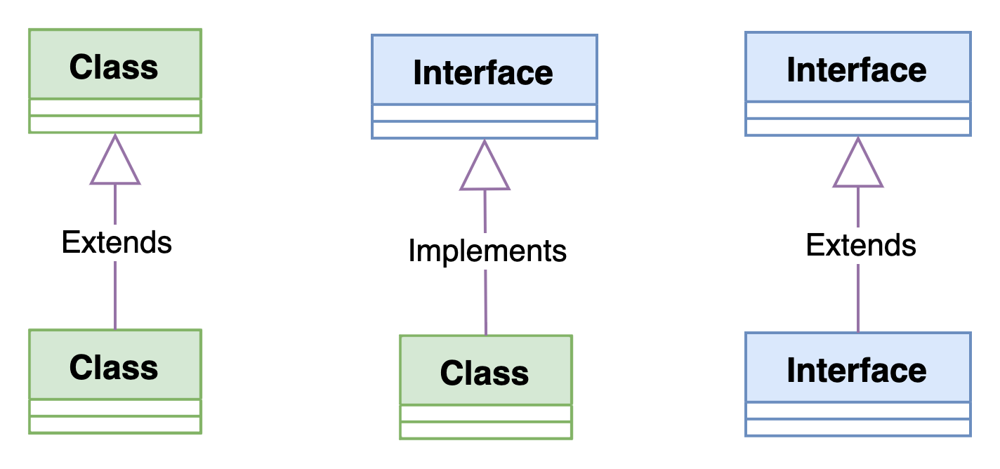

# Java OOP: Abstraction

<div class="pt-12">
  <span @click="$slidev.nav.next" class="px-2 py-1 rounded cursor-pointer" hover="bg-white bg-opacity-10">
    Press Space for next page <carbon:arrow-right class="inline"/>
  </span>
</div>

<div class="abs-br m-6 flex gap-2">
  <a href="https://github.com/mhmasum0/qa-june-2024-automation-with-java-slides" target="_blank" alt="GitHub" title="Open in GitHub"
    class="text-xl slidev-icon-btn opacity-50 !border-none !hover:text-white">
    <carbon-logo-github />
  </a>
</div>

<!--
The last comment block of each slide will be treated as slide notes. It will be visible and editable in Presenter Mode along with the slide. [Read more in the docs](https://sli.dev/guide/syntax.html#notes)
-->

---
hideInToc: true
---

# Agenda
<Toc />

---
layout: default
---
# Abstraction

> Abstraction is a process of <HL>hiding the implementation details</HL> and <HL>showing only functionality</HL> to the user.

For example, sending SMS where you type the text and send the message. <B>You don't know the internal processing about the message delivery</B>.

- One misunderstanding is that the reason for <HL>"hiding"</HL> something is security. 
  - In reality, it means hiding the complex details of how something works, just like how a car’s engine is hidden under the hood. You don’t need to know how the engine works to drive the car, and you can still see the engine if you want to.

- In programming, hiding the inner details of a class means users only need to know how to use it, not how it works inside. This also allows developers to change how the class works without causing problems for the users.

---
layout: center
---
# Ways to achieve Abstraction

1. Abstract Class <HL>(0 to 100%)</HL>
2. Interface <HL>(100%)</HL>

---
layout: quote
---
# Abstract Class

> A class which is <HL>declared as abstract</HL> is known as an abstract class. It can have <HL>abstract and non-abstract methods</HL>. It needs to be <HL>extended and its method implemented</HL>. It <HL>cannot be instantiated</HL>.

---
layout: default
---
# Abstract Class Behavior

- <HL>Common Base Implementation:</HL><br>
  Abstract classes provide a common base implementation for derived classes.
  When you want to define a set of methods with some default behavior that can be shared among multiple related classes, an abstract class is a good choice.
  Derived classes can inherit the common behavior and override specific methods as needed.
- <HL>Inheritance and Specialization:</HL><br>
  If you’re using inheritance, an abstract class acts as a blueprint for specialized classes.
  Abstract classes allow you to define methods that must be implemented by subclasses (abstract methods) alongside concrete methods with default behavior.
  Subclasses extend the abstract class and provide their own implementations for the abstract methods.
- <HL>Non-Public Members:</HL><br>
  Abstract classes can have non-public members (fields, methods).
  If you need to encapsulate certain functionality within the class hierarchy without exposing it publicly, an abstract class is suitable.

> Remember that a class can extend only one other class (abstract or not).
If you anticipate needing multiple inheritance (implementing behavior from multiple sources), interfaces are a better choice.

---
layout: default
---
# Code Example: Abstract Class

```java
abstract class Animal {
    abstract void sound();
    void eat() {
        System.out.println("Eating...");
    }
}

class Dog extends Animal {
    void sound() {
        System.out.println("Bark");
    }
}

class AbstractClassExample {
    public static void main(String[] args) {
        Animal animal = new Dog();
        animal.sound();
        animal.eat();
    }
}
```

---
layout: quote
---
# Interface

> Interface in Java is a blueprint of a class. It has static constants and abstract methods only.

<br>

> The interface in Java is a mechanism to achieve <HL>fully abstraction</HL>. There can be only <HL>abstract methods</HL> in the Java interface, not method body. It is used to achieve <HL>fully abstraction</HL> and <HL>multiple inheritance</HL> in Java.

<br><B>When you want to define a clear contract for behavior without providing any implementation, interfaces are the way to go.</B>

---
layout: quote
---
# Relationship with Classes and Interfaces



---
layout: default
---
# Code Example: Interface

```java
interface Animal {
    void sound();
    void eat();
}

class Dog implements Animal {
    public void sound() {
        System.out.println("Bark");
    }
    public void eat() {
        System.out.println("Eating...");
    }
}

class InterfaceExample {
    public static void main(String[] args) {
        Animal animal = new Dog();
        animal.sound();
        animal.eat();
    }
}
```

---
layout: default
---
# Multiple Inheritance in Interface


---
layout: default
---
# Code Example: Multiple Inheritance in Interface

```java
interface Animal {
    void sound();
}
interface Mammal {
    void eat();
}
class Dog implements Animal, Mammal {
    public void sound() {
        System.out.println("Bark");
    }
    public void eat() {
        System.out.println("Eating...");
    }
}
class InterfaceExample {
    public static void main(String[] args) {
        Dog dog = new Dog();
        dog.sound();
        dog.eat();
    }
}
```


---
src: ../../pages/common/end.md
---
