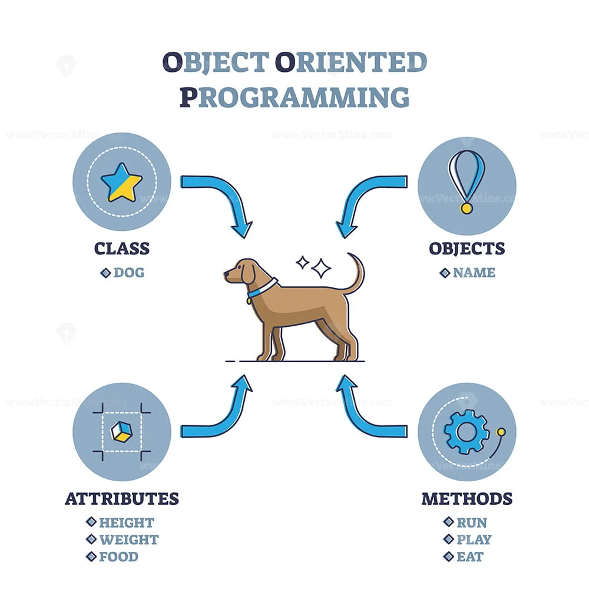
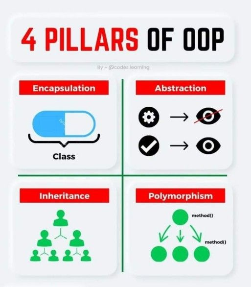
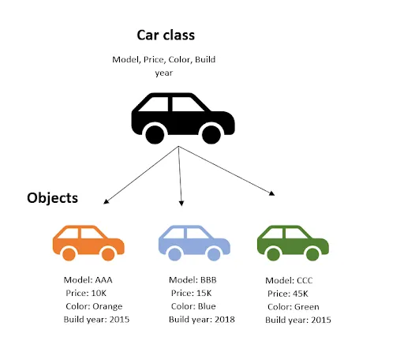
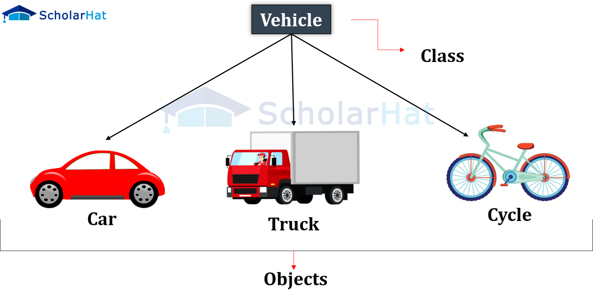

# Java OOP Fundamentals

<div class="pt-12">
  <span @click="$slidev.nav.next" class="px-2 py-1 rounded cursor-pointer" hover="bg-white bg-opacity-10">
    Press Space for next page <carbon:arrow-right class="inline"/>
  </span>
</div>

<div class="abs-br m-6 flex gap-2">
  <a href="https://github.com/mhmasum0/qa-june-2024-automation-with-java-slides" target="_blank" alt="GitHub" title="Open in GitHub"
    class="text-xl slidev-icon-btn opacity-50 !border-none !hover:text-white">
    <carbon-logo-github />
  </a>
</div>

<!--
The last comment block of each slide will be treated as slide notes. It will be visible and editable in Presenter Mode along with the slide. [Read more in the docs](https://sli.dev/guide/syntax.html#notes)
-->

---
hideInToc: true
---

# Agenda
<Toc />

---
layout: two-cols

---
# Java Object-Oriented Programming
 
> Object-oriented programming (OOP) is a programming paradigm based on the concept of "objects".

<ul v-motion-roll-visible-right>

<v-click><li v-motion-roll-left>Objects are instances of classes</li></v-click>
<v-click><li>Classes define the properties and behaviors of objects</li></v-click>
<v-click><li> Inheritance, Encapsulation, Abstraction , and polymorphism are the main concepts of OOP</li></v-click>

</ul>

Learn more about [Java OOP](https://docs.oracle.com/javase/tutorial/java/concepts/index.html)

::right::



<style>

.slidev-vclick-target {
  transition: all 500ms ease;
}

.slidev-vclick-hidden {
  transform: scale(0);
}
</style>

---
layout: two-cols
---
# Principles/Pillars of OOP

- **Inheritance**: Ability to create a new class from an existing class.
- **Abstraction**: Hiding the implementation details and showing only the functionality.
- **Encapsulation**: Wrapping up of data and methods into a single unit and keeping some data hidden to protect the data.
- **Polymorphism**: Ability of an object to take many forms.

::right::




---
layout: default
---
# Class

- A class is a blueprint for objects that defines the properties and behaviors of objects.




---
layout: default
---
# Object

- Object can be defined as an instance of a class.
- An object has two characteristics:
  - State: represents the data (value) of an object.
  - Behavior: represents the behavior (functionality) of an object.
- For example, a chair, pen, table, keyboard, bike, etc.





---
layout: default
---
# Constructor

- In Java, a constructor is a block of codes similar to the method. It is called when an instance of the class is created.
- Name of the constructor is the same as the class name.
- It is a special type of method which is used to initialize the object.
- Every time an object is created using the **_new_** keyword, at least one constructor is called.
- It calls a default constructor if there is no constructor available in the class. In such case, Java compiler provides a default constructor by default.


---
layout: center
---
# Types of Constructors

> There are two types of constructors in Java:

- **Default Constructor**: A constructor that has no parameter is known as a default constructor.
- **Parameterized Constructor**: A constructor that has parameters is known as a parameterized constructor.

---
layout: default
---
# Code Example of Default Constructor

```java
class Student {
    int id;
    String name;

    //creating a default constructor
    Student() {
        id = 101;
        name = "John";
    }

    void display() {
        System.out.println(id + " " + name);
    }

    public static void main(String args[]) {
        Student s1 = new Student();
        s1.display();
    }
}
```

---
layout: default
---
# Code Example of Parameterized Constructor

```java
class Student {
    int id;
    String name;

    //creating a parameterized constructor
    Student(int id, String name) {
        this.id = id;
        this.name = name;
    }

    void display() {
        System.out.println(id + " " + name);
    }

    public static void main(String args[]) {
        Student s1 = new Student(101, "John");
        Student s2 = new Student(102, "Smith");
        s1.display();
        s2.display();
    }
}
```

---
src: ../../pages/common/end.md
---
