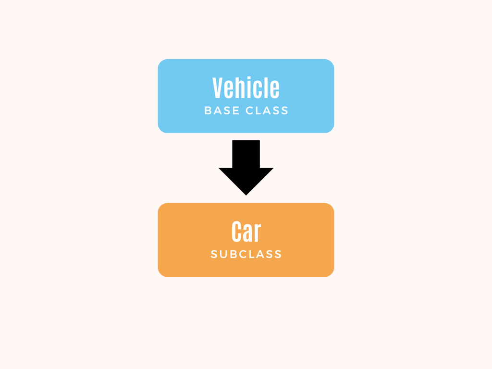
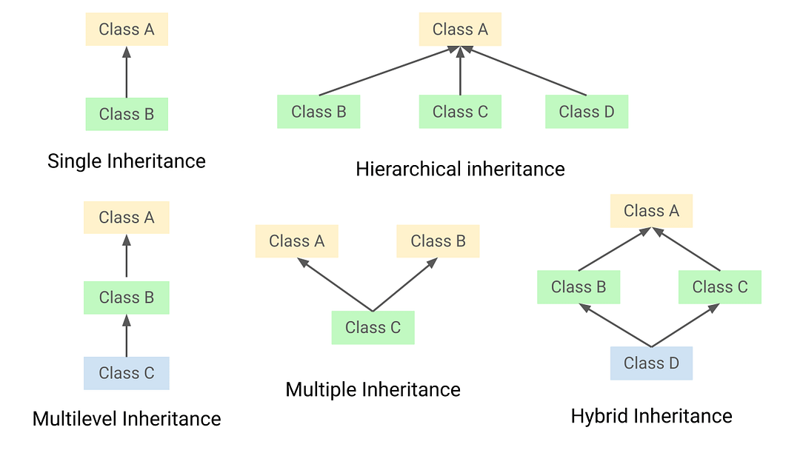
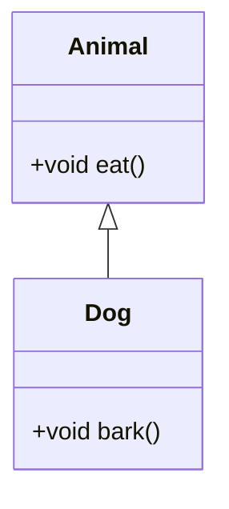
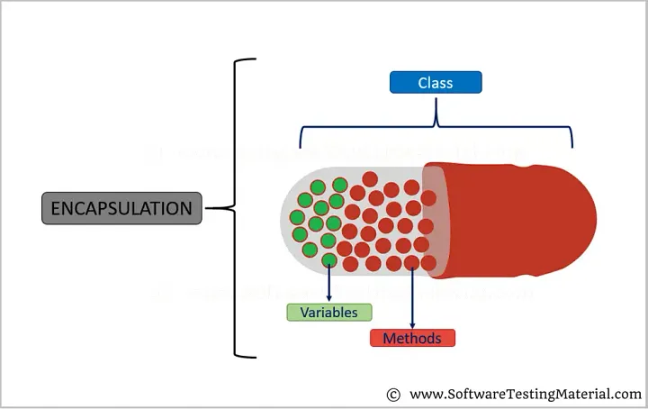

# Java OOP: Inheritance and Encapsulation

<div class="pt-12">
  <span @click="$slidev.nav.next" class="px-2 py-1 rounded cursor-pointer" hover="bg-white bg-opacity-10">
    Press Space for next page <carbon:arrow-right class="inline"/>
  </span>
</div>

<div class="abs-br m-6 flex gap-2">
  <a href="https://github.com/mhmasum0/qa-june-2024-automation-with-java-slides" target="_blank" alt="GitHub" title="Open in GitHub"
    class="text-xl slidev-icon-btn opacity-50 !border-none !hover:text-white">
    <carbon-logo-github />
  </a>
</div>

<!--
The last comment block of each slide will be treated as slide notes. It will be visible and editable in Presenter Mode along with the slide. [Read more in the docs](https://sli.dev/guide/syntax.html#notes)
-->

---
hideInToc: true
---

# Agenda
<Toc />

---
layout: two-cols

---
# Inheritance

> Inheritance in Java is a mechanism in which <HL>one object acquires all the properties and behaviors of a parent object.</HL> It is an important part of OOPs.

<br>

- When you inherit from an existing class, you can <HL>reuse methods and fields of the parent class.</HL>
- Moreover, you can <HL>add new methods and fields in your current class</HL> also.
- In the terminology of Java, a class which is inherited is called a <HL>parent or superclass</HL>, and the <HL>new class is called child or subclass</HL>.
- Inheritance represents the <HL>IS-A relationship</HL>.

::right::

<br><br>




---
layout: two-cols
---
# Types of Inheritance

1. **Single Inheritance**: A class inherits from only one class.
2. **Multilevel Inheritance**: A class inherits from a class which is already inherited from another class.
3. **Hierarchical Inheritance**: Multiple classes inherit from a single class.
4. **Hybrid Inheritance**: Combination of two or more types of inheritance.
5. **Multiple Inheritance**: A class inherits from more than one class.

::right::

<br><br>



---
layout: two-cols
---
# Code Example of Single Inheritance

```java
class Animal {
  void eat() {
    System.out.println("eating...");
  }
}

class Dog extends Animal {
  void bark() {
    System.out.println("barking...");
  }
}

class TestInheritance {
  public static void main(String[] args) {
    Dog dog = new Dog();
    dog.bark();
    dog.eat();
  }
}
```

::right::



---
layout: two-cols
---
# Encapsulation

> Encapsulation in Java is a process of wrapping code and data together into a single unit, for example, a capsule which is mixed of several medicines.

<br>

- We can create a fully encapsulated class in Java by making all the data members of the class private.
- Now we can use setter and getter methods to set and get the data in it.


::right::

<br><br>



---
layout: two-cols
---
# Getter and Setter Methods

<br>

- Getter and setter methods are used to <HL>access and modify the private fields of a class.</HL>
- Usually, <HL>class fields</HL> are decorated with a <HL>private access specifier.</HL>
- Thus, to access them, <HL>public access specifiers</HL> are used with the getter and setter methods.

::right::

<br><br>

```java
class Student {
  private String name;

  public String getName() {
    return name;
  }

  public void setName(String name) {
    this.name = name;
  }
}
```

---
layout: two-cols
---
# Super Keyword

- super can be used to <HL>refer immediate parent class instance variable</HL>.
- super can be used to <HL>invoke immediate parent class method</HL>.
- super() can be used to <HL>invoke immediate parent class constructor</HL>.

::right::

```java
class Animal {
    void eat() {
        System.out.println("Animal is eating...");
    }
}

class Dog extends Animal {
    void eat() {
        super.eat();  // Calls the parent class method
        System.out.println("Dog is eating...");
    }
}

public class TestSuper {
    public static void main(String[] args) {
        Dog dog = new Dog();
        dog.eat();
    }
}

```

---
layout: two-cols
---
# Java static keyword

- The static keyword in Java is used for <HL>memory management</HL> mainly.
- We can apply static keyword with <HL>variables, methods, blocks and nested classes.</HL>
- The static keyword <HL>belongs to the class</HL> than an instance of the class.
- The static variable can be used to refer to the common property of all objects (<HL>which is not unique for each object</HL>), for example, the company name of employees, college name of students, etc.

::right::

```java
class Student {
    int studentId; // instance variable
    String studentName;
    static String collegeName = "XYZ"; // static variable
    
    // constructor
    Student(int studentId, String studentName) {
        this.studentId = studentId;
        this.studentName = studentName;
    }
    
    // method to display the values
    void display() {
        System.out.println(studentId + " " + studentName + " " + collegeName);
    }
    
    public static void main(String args[]) {
        Student s1 = new Student(111, "Karan");
        Student s2 = new Student(222, "Aryan");
        
        s1.display();
        s2.display();
    }
}
```

---
layout: two-cols
---
# Java static method

> If you apply static keyword with any method, it is known as static method.

- A static method <HL>belongs to the class</HL> rather than the object of the class.
- A static method can be <HL>invoked without the need for creating an instance of a class.</HL>
- A static method can access <HL>static data member and can change the value of it.</HL>

::right::

```java
class Student {
    int studentId;
    String studentName;
    static String collegeName = "XYZ";
    // constructor
    Student(int studentId, String studentName) {
        this.studentId = studentId;
        this.studentName = studentName;
    }
    // static method to change the value of static variable
    static void change() {
        collegeName = "ABC";
    }
    // method to display the values
    void display() {
        System.out.println(studentId + " " + studentName + " " + collegeName);
    }
    
    public static void main(String args[]) {
        Student.change(); // calling change method
        Student s1 = new Student(111, "Karan");
        Student s2 = new Student(222, "Aryan");
        
        s1.display();
        s2.display();
    }
}
```


---
layout: default
---
# Final Keyword

> The final keyword in java is used to <HL>restrict the user</HL>. The java final keyword can be used in many context. Final can be:

- **Variable**: Stops value change.
- **Method**: Stops method overriding.
- **Class**: Stops inheritance.


```java
class Bike {
    final int speedlimit = 90; // final variable
    void run() {
        speedlimit = 400; // Compile Time Error
    }
}

class Main {
    public static void main(String args[]) {
        Bike obj = new Bike();
        obj.run();
    }
}

```


---
src: ../../pages/common/end.md
---
