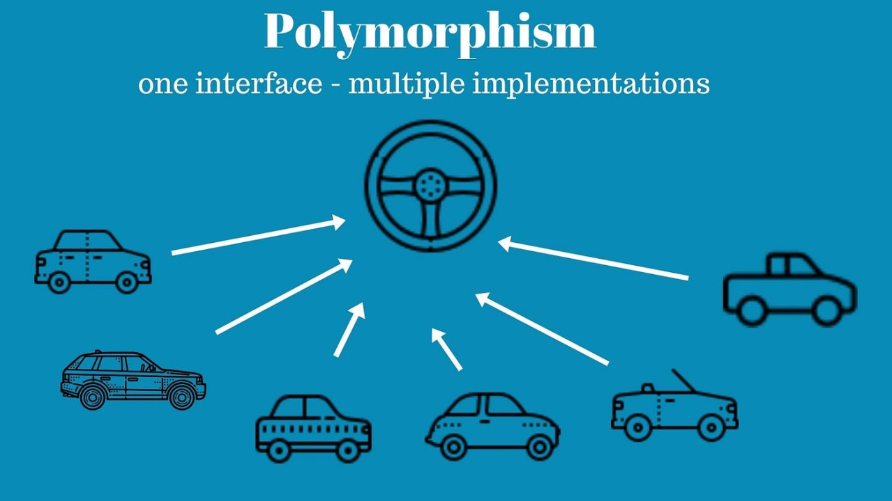
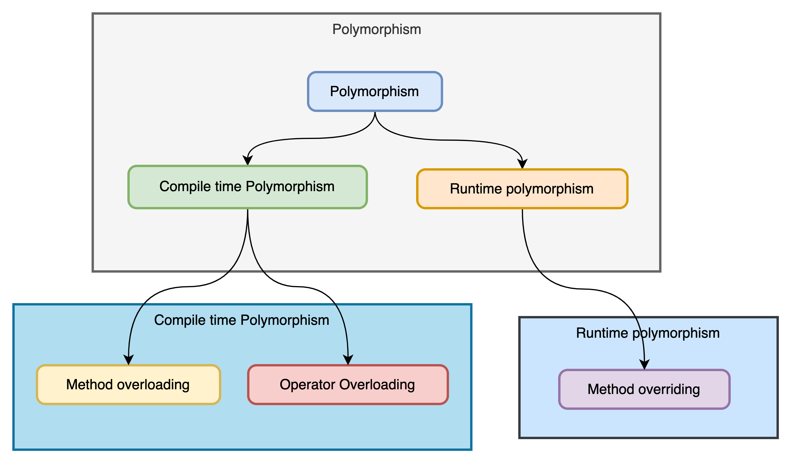
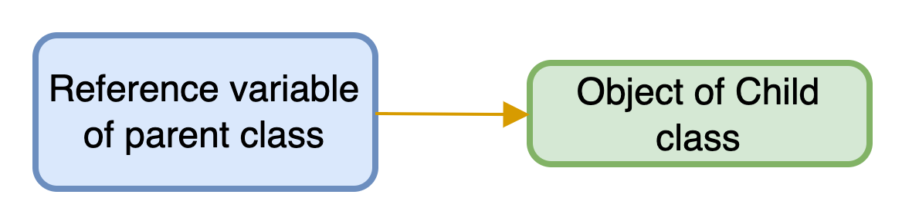

# Java OOP: Polymorphism, Method Overloading and Overriding

<div class="pt-12">
  <span @click="$slidev.nav.next" class="px-2 py-1 rounded cursor-pointer" hover="bg-white bg-opacity-10">
    Press Space for next page <carbon:arrow-right class="inline"/>
  </span>
</div>

<div class="abs-br m-6 flex gap-2">
  <a href="https://github.com/mhmasum0/qa-june-2024-automation-with-java-slides" target="_blank" alt="GitHub" title="Open in GitHub"
    class="text-xl slidev-icon-btn opacity-50 !border-none !hover:text-white">
    <carbon-logo-github />
  </a>
</div>

<!--
The last comment block of each slide will be treated as slide notes. It will be visible and editable in Presenter Mode along with the slide. [Read more in the docs](https://sli.dev/guide/syntax.html#notes)
-->

---
hideInToc: true
---

# Agenda
<Toc />

---
layout: two-cols

---
# Polymorphism

- Polymorphism is derived from <HL>2 Greek words</HL>: poly and morphs. The word <HL>"poly" means many</HL> and <HL>"morphs" means forms</HL>. So polymorphism means many forms.
- Polymorphism allows objects of different classes to be treated as objects of a common super class.
- The most common use of polymorphism in Java is when a parent class reference is used to refer to a child class object.

::right::

<br>



---
layout: two-cols
---
# Types of Polymorphism

> There are two types of polymorphism in Java

- Compile-time polymorphism
- Run-time polymorphism

<br>

> 1. We can perform <HL>compile-time polymorphism by method overloading</HL>.<br>
> 2. We can perform <HL>run-time polymorphism by method overriding</HL>.<br> 
> 3. **_Java does not support operator overloading._**

::right::



---
layout: center
---
# Early Binding (Compile-time Polymorphism)

- Achieved through <HL>method overloading</HL>, where multiple methods have the same name but different parameters within the same class.
- The method to be executed is determined at <HL>compile time</HL> based on the method signature.

---
layout: two-cols
---
# Runtime Polymorphism

- <HL>Runtime polymorphism</HL> or <HL>Dynamic Method Dispatch</HL> is a process in which a call to an overridden method is resolved at runtime rather than compile-time.
- In this process, an overridden method is called through the <HL>reference variable of a superclass</HL>.

<br>


::right::

# Upcasting

> Upcasting is the typecasting of a child object to a parent object.

<br>



```java
class A{}
class B extends A{}
A a = new B(); // Upcasting
```

---
layout: default
zoom: 0.89
---

# Code Example of Runtime Polymorphism
```java
class Animal {
    void sound() {
        System.out.println("Animals make sound");
    }
}
class Dog extends Animal {
    @Override
    void sound() {
        System.out.println("Dog barks");
    }
}
class Cat extends Animal {
    @Override
    void sound() {
        System.out.println("Cat meows");
    }
}
public class Main {
    public static void main(String[] args) {
        Animal myAnimal;

        myAnimal = new Dog();
        myAnimal.sound();  // Calls Dog's sound method

        myAnimal = new Cat();
        myAnimal.sound();  // Calls Cat's sound method
    }
}
```

---
layout: center
---
# Method Overloading

> If a class has multiple methods having <HL>same name but different in parameters</HL>, it is known as Method Overloading.

There are two ways to overload the method in Java:
1. By changing the number of arguments
2. By changing the data type

---
layout: two-cols
---
# Code Example of Method Overloading


> Changing the number of arguments

```java
class Adder {
    static int add(int a, int b) {
        return a + b;
    }
    static int add(int a, int b, int c) {
        return a + b + c;
    }
}
```


::right::


> Changing the data type

```java
class Adder {
    static int add(int a, int b) {
        return a + b;
    }
    static double add(double a, double b) {
        return a + b;
    }
}
```

---
layout: default
---
# Method Overriding

> If subclass (child class) has the <HL>same method as declared in the parent class</HL>, it is known as method overriding in Java.

<br>

<C>Usage of Java Method Overriding:</C>
- Method overriding is used to provide the specific implementation of a method which is already provided by its superclass.
- Method overriding is used for runtime polymorphism

<br>

# Rules for Java Method Overriding
- The method <HL>must have the same name</HL> as in the parent class
- The method <HL>must have the same parameter</HL> as in the parent class.
- There <HL>must be an IS-A relationship</HL> (inheritance).

---
src: ../../pages/common/end.md
---
