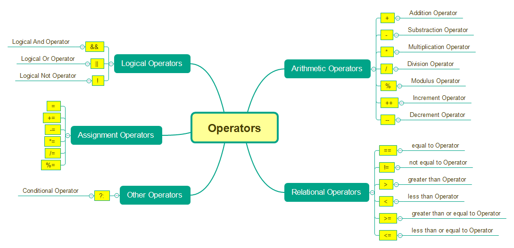
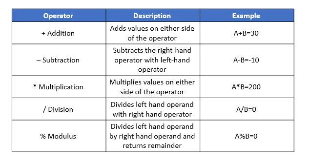
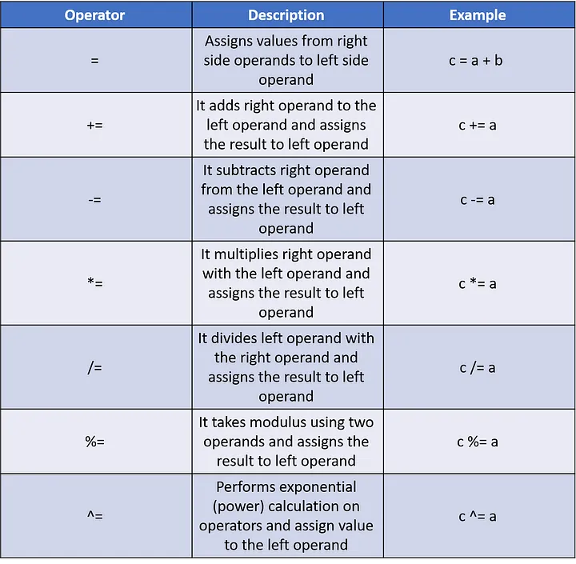
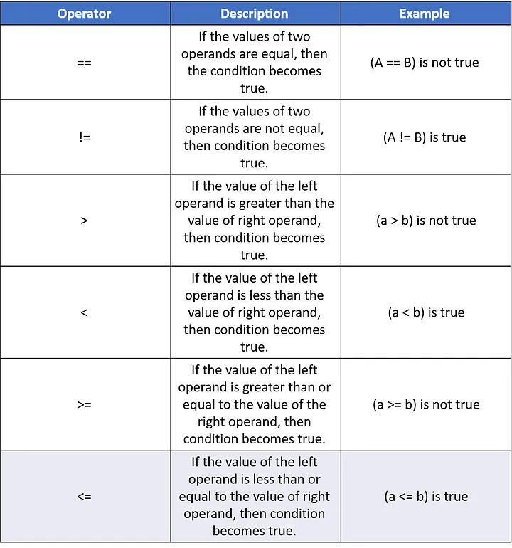
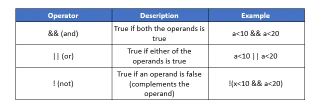
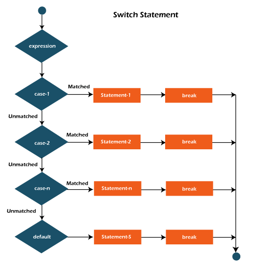

---
# You can also start simply with 'default'
theme: seriph
background: https://cover.sli.dev
title: Operators and Control Statements | QAJune2024 Automation with java
info: |
  ## Operators and Control Statements | QAJune2024 Automation with java
exportFilename: java-operators-control-statements
drawings:
  persist: false
transition: slide-left
mdc: true
hideInToc: true
---
# Introduction to Java

---
src: ../../pages/common/about-me.md
---

---
src: ../../pages/common/toc.md
---

---
layout: default
---
# Operators
Operators are symbols that perform operations on variables and values.



---
layout: default
---
# Types of Operators
- Arithmetic Operators
- Assignment Operators
- Relational Operators
- Logical Operators
- Unary Operators
- Ternary Operators
- Shift Operators
- Bitwise Operators

Article 1: [Operators in Java](https://www.programiz.com/java-programming/operators)<br>
Article 2: [Operators in Java](https://www.javatpoint.com/operators-in-java)


---
layout: default
---
# Arithmetic Operators
Arithmetic operators are used to perform common mathematical operations.



---
layout: default
---
# Assignment Operators
Assignment operators are used to assign values to variables.


---
layout: default
---
# Relational/Comparison Operators
Relational operators are used to compare two values.




---
layout: default
---
# Logical Operators
Logical operators are used to check whether an expression is `true` or `false`.



---
layout: default
---
# Java Control Statements
In programming, control flow is the order in which code is executed
- **Decision Making statements**
  - _if statements_
  - _switch statement_
- **Loop statements**
    - _do while loop_
    - _while loop_
    - _for loop_
    - _for-each loop_
- **Jump statements**
  - _break statement_
  - _continue statement_

Article 1: [Java Control Statements](https://www.javatpoint.com/control-flow-in-java)<br>

---
layout: default
---
# IF/ELSE Statements
if statement is used to test the condition. It checks boolean condition: true or false. There are various types of if statement in Java.
- if statement
- if-else statement
- If-else-if ladder
- nested if statement

---
layout: default
---
# IF/ELSE Statements Code Example
```java
public class Main {

    public static void main(String[] args) {
        boolean isLightOn = false;

        if(isLightOn) {
            System.out.println("The light is turned on");
        } else {
            System.out.println("The light is turned off");
        }
    }
}
```
---
layout: default
---
# ELSE IF Statements Code Example
```java
public class Main {

    public static void main(String[] args) {
        int number = 50;

        if(number <= 20) {
            System.out.println("Number is less than or equal to 20");
        } else if(number < 40) {
            System.out.println("Number is between 20 and 40");
        } else {
            System.out.println("Number is greater than or equal 40");
        }
    }
}
```
---
layout: default
---
# Switch Statements



---
layout: default
---
# Switch Statements Code Example
```java
int day = 4;
switch (day) {
  case 1:
    System.out.println("Monday");
    break;
  case 2:
    System.out.println("Tuesday");
    break;
  case 3:
    System.out.println("Wednesday");
    break;
  case 7:
    System.out.println("Sunday");
    break;
  default:
    System.out.println("Invalid day");
    break;
}
```

---
src: ../../pages/common/end.md
---
