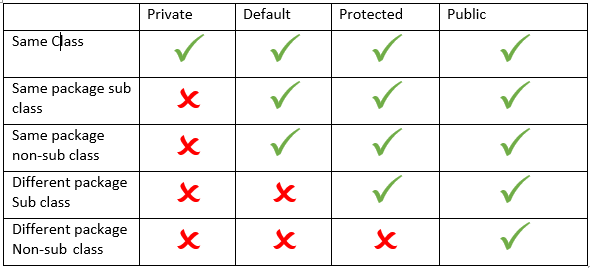
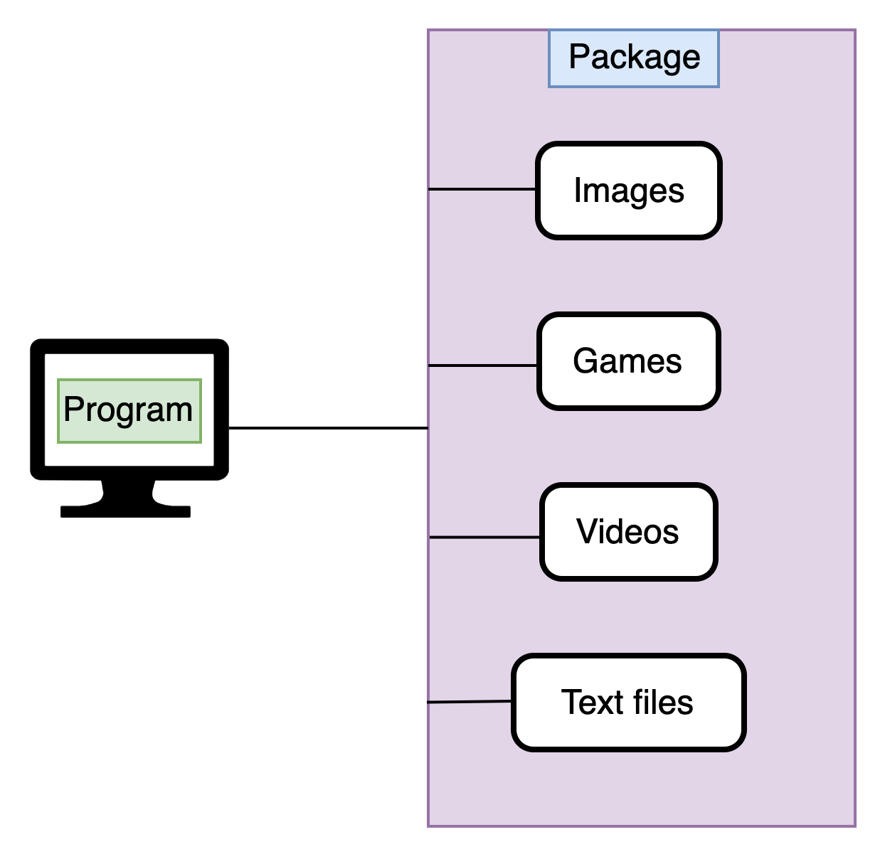

# Java Package

<div class="pt-12">
  <span @click="$slidev.nav.next" class="px-2 py-1 rounded cursor-pointer" hover="bg-white bg-opacity-10">
    Press Space for next page <carbon:arrow-right class="inline"/>
  </span>
</div>

<div class="abs-br m-6 flex gap-2">
  <a href="https://github.com/mhmasum0/qa-june-2024-automation-with-java-slides" target="_blank" alt="GitHub" title="Open in GitHub"
    class="text-xl slidev-icon-btn opacity-50 !border-none !hover:text-white">
    <carbon-logo-github />
  </a>
</div>

<!--
The last comment block of each slide will be treated as slide notes. It will be visible and editable in Presenter Mode along with the slide. [Read more in the docs](https://sli.dev/guide/syntax.html#notes)
-->

---
hideInToc: true
---

# Agenda
<Toc />

---
layout: two-cols
---

# Access Modifiers

> Private < Default < Protected < Public

<br>

- Public (accessible from anywhere)
- Private (accessible within the class)
- Protected (accessible within the package and outside the package through inheritance)
- Default (accessible within the package) 

::right::

<br><br>



---
layout: center
---

# Why Package?

- Java package provides access protection.
- Java package removes naming collision.
- Java package is used to categorize the classes and interfaces so that they can be easily maintained.


---
layout: center
---

# Package

> A java package is a group of similar types of classes, interfaces and sub-packages.



---
layout: center
---

# Types of Package

1. Built-in Package
2. User-defined Package

---
layout: two-cols
---

# Java Package Import

> There are two types of package import in Java:

- Specific Importing
- Wildcard Importing

<br>

> If you use <HL>`package.*`</HL> then all the classes and interfaces of this package will be accessible but <HL>not subpackages</HL>.

<br>

> The import keyword is used to make the classes and interface of another package accessible to the current package.


::right::

# Specific Importing

```java
import java.util.ArrayList;
import java.util.List;
```

# Wildcard Importing

```java
import java.util.*;
```

---
layout: two-cols
---

# Code Example of Package

```java
package package1;
public class A {
    public void msg() {
        System.out.println("Hello");
    }
}
```

```java
package package2;
import package1.A;
public class B {
    public static void main(String[] args) {
        A obj = new A();
        obj.msg();
    }
}
```

::right::
# Example of fully qualified name

```java
package package1;
public class A {
    public void msg() {
        System.out.println("Hello");
    }
}
```

```java

public class B {
    public static void main(String[] args) {
        package1.A obj = new package1.A();
        obj.msg();
    }
}
```

---
layout: center
---

# Subpackage in Java

- A package inside another package is called the subpackage.

> The standard of defining package is domain.company.package e.g. com.mahmud.bean

```java
package com.mahmud;
public class A {
    public void msg() {
        System.out.println("Hello");
    }
}
```

```java
package com.mahmud.A;
public class B {
    public static void main(String[] args) {
        com.mahmud.A obj = new com.mahmud.A();
        obj.msg();
    }
}
```


---
src: ../../pages/common/end.md
---