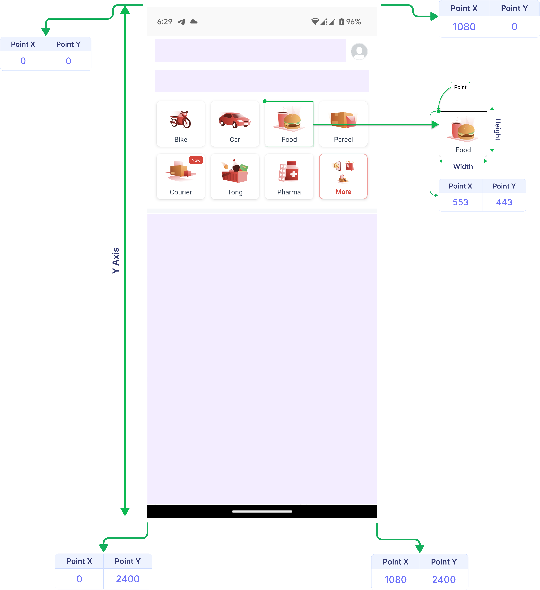

# Selenium WebDriver JavaScript Executor & Elements

<div class="pt-12">
  <span @click="$slidev.nav.next" class="px-2 py-1 rounded cursor-pointer" hover="bg-white bg-opacity-10">
    Press Space for next page <carbon:arrow-right class="inline"/>
  </span>
</div>

<div class="abs-br m-6 flex gap-2">
  <a href="https://github.com/mhmasum0/qa-june-2024-automation-with-java-slides" target="_blank" alt="GitHub" title="Open in GitHub"
    class="text-xl slidev-icon-btn opacity-50 !border-none !hover:text-white">
    <carbon-logo-github />
  </a>
</div>

<!--
The last comment block of each slide will be treated as slide notes. It will be visible and editable in Presenter Mode along with the slide. [Read more in the docs](https://sli.dev/guide/syntax.html#notes)
-->

---
hideInToc: true
---

# Agenda
<Toc />

---
layout: center
---

# JavaScript Executor in Selenium WebDriver

> <B>JavaScriptExecutor:</B> An interface in Selenium WebDriver used to execute JavaScript code within the context of the browser.

<br>

> <B>Purpose:</B> Allows direct interaction with the DOM and browser's JavaScript engine, enabling advanced operations not directly supported by WebDriver.

<br> 

> <B>Key Methods:</B> executeScript(): Executes JavaScript code synchronously
```java
JavascriptExecutor js = (JavascriptExecutor) driver;
js.executeScript("return document.title;");
```

---
layout: center
---

# JavaScript Executor Use Cases

- <B>Scrolling:</B> `js.executeScript("window.scrollBy(0,1000);");`
- <B>Handling Hidden Elements:</B> `js.executeScript("arguments[0].click();", hiddenElement);`
- <B>Scroll to an Element:</B> `js.executeScript("arguments[0].scrollIntoView(true);", element);`
- <B>Highlight Element:</B> `js.executeScript("arguments[0].style.border='3px solid red';", element);`

---
layout: center
---

# Code Example: JavaScript Executor

```java
class JavaScriptExecutorExample {
    public static void main(String[] args) {
        WebDriver driver = new ChromeDriver();
        driver.get("http://www.facebook.com");
        JavascriptExecutor js = (JavascriptExecutor) driver;
        
        String title = (String) js.executeScript("return document.title;");
        System.out.println("Title: " + title);

        WebElement username= driver.findElement(By.id("email"));

        js.executeScript("arguments[0].setAttribute('style', 'background: yellow; border: 2px solid red;');", username);
        Thread.sleep(1000);
        
        driver.quit();
    }
}
```

---
layout: center
---

# Selenium WebDriver Elements Not Clickable Exception

> <B>Problem:</B> Selenium WebDriver throws `ElementNotInteractableException` when trying to interact with an element that is not clickable.

<br>

> <B>Reasons:</B> Element is present in the DOM but cannot be interacted with. The element is not interactable in the sense it cannot be clicked or send keys cannot work as the element is:
- not visible or hidden
- disabled
- outside the viewport and inaccessible
- overlapped by another element
- not completely rendered on the page

---
layout: two-cols
---

# Handling Hidden Elements

<HL>Using:</HL>
- `getLocation().getX();`
- `getLocation().getY();`

<B>Because Hidden Elements doesn’t have X,Y coordinates</B>

::right::



---
layout: center
---

# Code Example: Handling Hidden Elements

```java
class HiddenElementExample {
    public static void main(String[] args) {
        WebDriver driver = new ChromeDriver();
        driver.get("http://seleniumpractise.blogspot.in/2016/08/how-to-automate-radio-button-in.html");

        List<WebElement> radio = driver.findElements(By.id("male"));
        int count = radio.size();
        System.out.println("Total radio buttons " + count);

        for (int i = 0; i < count; i++) {
            int x = radio.get(i).getLocation().getX();
            int y = radio.get(i).getLocation().getY();
            System.out.println("X:" + x);
            System.out.println("Y:" + y);
            if (x != 0) {
                radio.get(i).click();
                break;
            }
        }
        
        driver.quit();
    }
}
```

---
layout: center
---

# Code Example: Handling Calendar

```java
class CalendarExample {
    public static void main(String[] args) {
        WebDriver driver = new ChromeDriver();
        driver.get("https://www.globalsqa.com/demo-site/datepicker/");

        driver.switchTo().frame(driver.findElement(By.xpath("//iframe[@class='demo-frame lazyloaded']")));
        driver.findElement(By.xpath("//input[@class='hasDatepicker']")).click();
        List<WebElement> dates =  driver.findElements(By.xpath("//table[@class='ui-datepicker-calendar']//td"));

        int total_nodes = dates.size();
        System.out.println("Total nodes: " + total_nodes);
        for(int i=0; i<total_nodes; i++) {
            String date = dates.get(i).getText();
            if(date.equalsIgnoreCase("20")) {
                dates.get(i).click();
                break;
            }
        }
        
        driver.quit();
    }
}
```

---
src: ../../pages/common/end.md
---