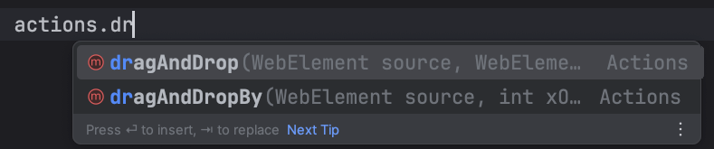

# Selenium WebDriver Actions

<div class="pt-12">
  <span @click="$slidev.nav.next" class="px-2 py-1 rounded cursor-pointer" hover="bg-white bg-opacity-10">
    Press Space for next page <carbon:arrow-right class="inline"/>
  </span>
</div>

<div class="abs-br m-6 flex gap-2">
  <a href="https://github.com/mhmasum0/qa-june-2024-automation-with-java-slides" target="_blank" alt="GitHub" title="Open in GitHub"
    class="text-xl slidev-icon-btn opacity-50 !border-none !hover:text-white">
    <carbon-logo-github />
  </a>
</div>

<!--
The last comment block of each slide will be treated as slide notes. It will be visible and editable in Presenter Mode along with the slide. [Read more in the docs](https://sli.dev/guide/syntax.html#notes)
-->

---
hideInToc: true
---

# Agenda
<Toc />

---
layout: center
---

# WebDriver Actions in Selenium

> The Actions class in Selenium WebDriver is a powerful feature used to automate complex user interactions on web applications. This class is part of the `org.openqa.selenium.interactions` package and allows you to perform advanced user interactions like mouse movements, keypresses, drag-and-drop operations, and other interactions that are not possible using the basic WebDriver methods.

## Examples:
- Mouse Actions
- Keyboard Actions
- Drag & Drop actions

Documentation: [Selenium WebDriver Actions](https://www.selenium.dev/selenium/docs/api/java/org/openqa/selenium/interactions/Actions.html)

---
layout: center
---

# Double Click: Code Example

```java
class DoubleClickExample {
    public static void main(String[] args) {
        WebDriver driver = new ChromeDriver();

        driver.get("https://api.jquery.com/dblclick/");

        driver.switchTo().frame(driver.findElement(By.xpath("//iframe")));

        Actions actions = new Actions(driver);

        WebElement squareBox = driver.findElement(By.xpath("//span[text()='Double click the block']//parent::body/div"));
        actions.doubleClick(squareBox).perform();

        Thread.sleep(3000);

        System.out.println("Yeeee I double clicked the element !!! wowww !!!");
        driver.quit();
    }
}
```

---
layout: center
---

# Right Click: Code Example

```java
class RightClickExample {
    public static void main(String[] args) {
        WebDriver driver = new ChromeDriver();

        driver.get("https://swisnl.github.io/jQuery-contextMenu/demo.html");
        driver.manage().window().maximize();

        Actions actions = new Actions(driver);

        actions.contextClick(driver.findElement(By.xpath("//span[contains(text(),'right click me')]"))).perform();

        driver.findElement(By.xpath("//li[@class='context-menu-item context-menu-icon context-menu-icon-copy']")).click();
        System.out.println(driver.switchTo().alert().getText());

        Thread.sleep(3000);

        driver.switchTo().alert().accept();

        Thread.sleep(3000);

        driver.quit();
    }
}
```

---
layout: center
---

# Jquery - Draggable

> Functionality: Allows elements to be clicked and dragged using the mouse.

## Common Use Cases:
- Rearranging items on a page.
- Implementing custom sliders.
- Creating drag-and-drop interfaces.

Documentation: [Jquery Draggable](https://jqueryui.com/draggable/)

---
layout: center
---

# Jquery - Droppable

> Functionality: Designates elements as targets for draggable items.

## Common Use Cases:
- Building drag-and-drop file uploaders.
- Creating interactive games.
- Developing intuitive UI components.

## Playground
[URL: 1](https://dhtmlx.com/docs/products/dhtmlxTree/)
<br>[URL: 2](https://www.w3schools.com/html/html5_draganddrop.asp)



---
layout: center
---

# Drag and Drop(Manual) : Code Example

```java
class DragAndDropManualExample {
    public static void main(String[] args) {
        WebDriver driver = new ChromeDriver();

        driver.get("https://dhtmlx.com/docs/products/dhtmlxTree/");
        driver.manage().window().maximize();

        driver.switchTo().frame(driver.findElement(By.xpath("//iframe[@class='js-iframe active']")));

        Actions actions = new Actions(driver);

        WebElement src = driver.findElement(By.xpath("//span[text()='Lawrence Block']"));
        WebElement dest = driver.findElement(By.xpath("//li[text()='Zend Framework in Action']"));

        actions.clickAndHold(src)
                .pause(Duration.ofSeconds(2))
                .moveToElement(dest)
                .pause(Duration.ofSeconds(2))
                .release()
                .build()
                .perform();

        driver.quit();
    }
}
``` 

---
layout: center
---

# Drag and Drop(Auto) : Code Example

```java
class DragAndDropAutoExample {
    public static void main(String[] args) {
        WebDriver driver = new ChromeDriver();

        driver.get("https://dhtmlx.com/docs/products/dhtmlxTree/");
        driver.manage().window().maximize();

        driver.switchTo().frame(driver.findElement(By.xpath("//iframe[@class='js-iframe active']")));

        WebElement src = driver.findElement(By.xpath("//span[text()='Lawrence Block']"));
        WebElement dest = driver.findElement(By.xpath("//li[text()='Zend Framework in Action']"));

        Actions actions = new Actions(driver);
        actions.dragAndDrop(src, dest).perform();

        driver.quit();
    }
}
```

---
layout: center
---

# Draggable: Code Example

```java
class DraggableExample {
    public static void main(String[] args) {
        WebDriver driver = new ChromeDriver();

        driver.get("https://jqueryui.com/draggable/");
        driver.manage().window().maximize();
        driver.switchTo().frame(driver.findElement(By.tagName("iframe")));

        Actions actions = new Actions(driver);
        WebElement src = driver.findElement(By.xpath("//div[@id='draggable']"));

        actions.dragAndDropBy(src,394, 16).perform();
    }
}
```
---
layout: center
---

# Keyboard Actions

> Keyboard Actions: Enables simulation of keyboard events like key presses and releases.

## Common Keyboard Actions:
- sendKeys(): Sends a sequence of keystrokes to an element.
- keyDown(): Simulates pressing a key down.
- keyUp(): Simulates releasing a key.

---
layout: center
---

# Keyboard Actions: Code Example

```java
class KeyboardActionsExample {
    public static void main(String[] args) {
        WebDriver driver = new ChromeDriver();

        driver.get("http://www.google.com");

        driver.manage().window().maximize();

        Actions actions =new Actions(driver);

        actions.click(driver.findElement(By.xpath("//textarea[@name='q']")))
                .sendKeys("Nexxvali")
                .pause(Duration.ofSeconds(2))
                .sendKeys(Keys.ARROW_DOWN)
                .pause(Duration.ofSeconds(2))
                .sendKeys(Keys.ENTER)
                .build()
                .perform();

    }
}
```

---
layout: two-cols
---

# Keyboard Actions: Code Snippet

<B> Selecting all text </B>

```java
Actions actions = new Actions(driver);
actions.click(inputField)
        .keyDown(Keys.CONTROL)
        .sendKeys("a")
        .keyUp(Keys.CONTROL)
        .build()
        .perform();
```

::right::
<B> Copy-Paste Text</B>

```java
Actions actions = new Actions(driver);
actions.click(inputField)
        .keyDown(Keys.CONTROL)
        .sendKeys("a")
        .sendKeys("c")
        .keyUp(Keys.CONTROL)
        .sendKeys(Keys.TAB)
        .keyDown(Keys.CONTROL)
        .sendKeys("v")
        .keyUp(Keys.CONTROL)
        .build()
        .perform();

```

---

# Summery
- Action Class: Essential for handling complex keyboard interactions.
- Key Methods: sendKeys(), keyDown(), keyUp().
- Practical Use: Automating tasks like text input, selection, and copy-paste.

Playground: [URL](https://the-internet.herokuapp.com/key_presses)

---
layout: center
---

# Mouse Hover

- Mouse Hover: Simulates mouse movement to an element without clicking it.
- Common Use Case: To reveal hidden elements or trigger hover-dependent events (like dropdown menus).
- Action Class
- Purpose: Provides methods to handle complex user gestures.
- Key Method: moveToElement() – moves the mouse to the middle of the element.

---
layout: center
---

# Mouse Hover: Code Example

```java
class MouseHoverExample {
    public static void main(String[] args) {
        WebDriver driver = new ChromeDriver();

        driver.get("http://seleniumpractise.blogspot.com/2016/08/how-to-perform-mouse-hover-in-selenium.html");

        driver.manage().window().maximize();

        WebElement hoverButton = driver.findElement(By.xpath("//button [text()='Automation Tools']"));

        Actions act = new Actions(driver);
        act.moveToElement(hoverButton).perform();

        List<WebElement> links = driver.findElements(By.xpath("//div[@class='dropdown-content']//a"));
        int total_count = links.size();

        for (int i = 0; i < total_count; i++) {

            WebElement element = links.get(i);
            String text = element.getAttribute("href");
            System.out.println("Link: " + text);
        }
    }
}
```


---
src: ../../pages/common/end.md
---