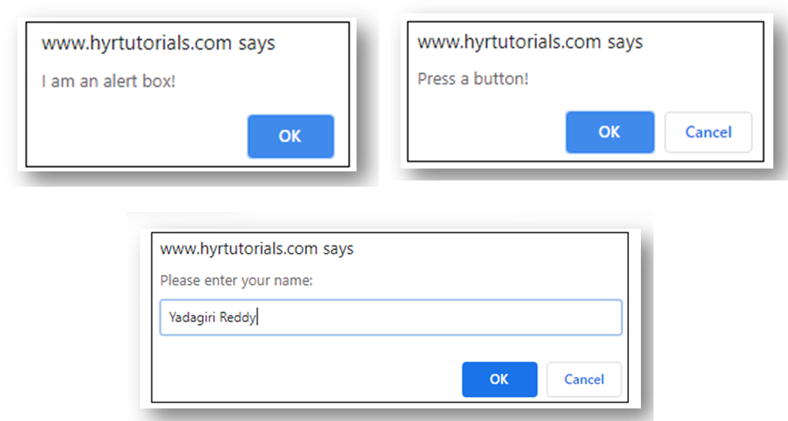
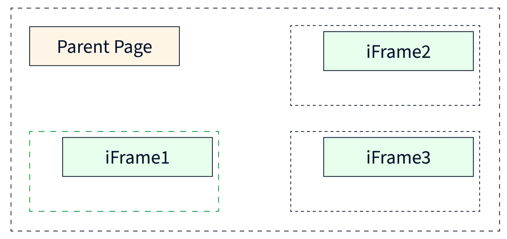
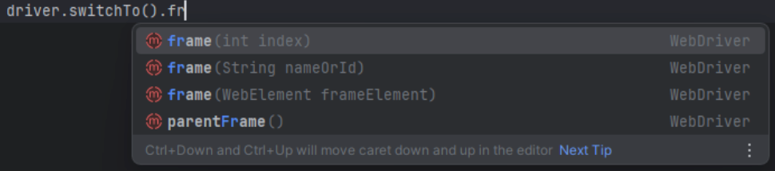

# Selenium WebDriver Alert, Iframe and Window

<div class="pt-12">
  <span @click="$slidev.nav.next" class="px-2 py-1 rounded cursor-pointer" hover="bg-white bg-opacity-10">
    Press Space for next page <carbon:arrow-right class="inline"/>
  </span>
</div>

<div class="abs-br m-6 flex gap-2">
  <a href="https://github.com/mhmasum0/qa-june-2024-automation-with-java-slides" target="_blank" alt="GitHub" title="Open in GitHub"
    class="text-xl slidev-icon-btn opacity-50 !border-none !hover:text-white">
    <carbon-logo-github />
  </a>
</div>

<!--
The last comment block of each slide will be treated as slide notes. It will be visible and editable in Presenter Mode along with the slide. [Read more in the docs](https://sli.dev/guide/syntax.html#notes)
-->

---
hideInToc: true
---

# Agenda
<Toc />

---
layout: two-cols
---

# Alert Box

> Alert is a small message/dialog box that appears on the top of a web application and it provides some information/warning to the user. Sometimes, it also expects input information from the user.

- Alert box (Simple Alerts)
- Confirm box (Confirmation Alerts)
- Prompt box (Prompt Alerts)

::right::



---
layout: center
---

# Code Example: Alert Box

```java
class AlertBox {
    public static void main(String[] args) {
        WebDriver driver = new ChromeDriver();
        driver.get("https://demo.automationtesting.in/Alerts.html");
        driver.manage().window().maximize();

        driver.findElement(By.xpath("//button[contains(text(),'alert box:')]")).click();
        Thread.sleep(2000);

        Alert alertElement = driver.switchTo().alert();

        //Getting the alert message:
        System.out.println(driver.switchTo().alert().getText());

        alertElement.accept();

        //Using method chaining:
        // driver.switchTo().alert().accept();
    }
}
```

---
layout: center
---

# Iframe

> An iframe, or inline frame, is an HTML element that acts like a window within a webpage. It essentially embeds another whole HTML document, allowing you to display content from an external source directly on your page.



---
layout: center
---

# Iframe HTML Example

```html
<!DOCTYPE html>
<html>
    <body>
        <iframe src="https://www.hyrtutorials.com/" width="400" height="400" name="selenium">
          <p>Your browser does not support iframes.</p>
        </iframe>
        <iframe src="https://demo.automationtesting.in" width="400" height="400" id="w3c">
          <p>Your browser does not support iframes.</p>
        </iframe>
        <iframe src="http://www.seleniumhq.org" width="400" height="400" title="selenium_news">
          <p>Your browser does not support iframes.</p>
        </iframe>
        <br>
        <a href="https://www.google.com">Click here for Selenium tutorial </a>
    </body>
</html>
```

---
layout: center
---

# Different Ways to Switch to Iframe

1. using name or id
2. using index
3. Using Web Element (Most recommended)



---
layout: center
---

# Code Example: Switch to Iframe

```java
public class IframeExample {
    public static void main(String[] args) {
        WebDriver driver = new ChromeDriver();
        driver.get("file:///Users/mahmud/IdeaProjects/selenium-webdriver-automation/iframe.html");
        driver.manage().window().maximize();

        int numOfiframes = driver.findElements(By.tagName("iframe")).size();
        System.out.println("Numbers of iframe: " + numOfiframes);
        driver.switchTo().frame("selenium");

        driver.switchTo().defaultContent();

        WebElement newFrame = driver.findElement(By.xpath("//iframe[@title='selenium_news']"));

        driver.switchTo().frame(newFrame);
        driver.findElement(By.xpath("//*[@type='button'][@class='navbar-toggler']")).click();


        driver.switchTo().defaultContent();

        driver.findElement(By.xpath("//*[@href=\"https://www.google.com\"]")).click();
    }
}
```

---
layout: center
zoom: 0.9
---

# Multiple Windows or Tabs: Code Example

```java
public class MultipleWindows {
    public static void main(String[] args) {
        WebDriver driver = new ChromeDriver();
        driver.get("http://seleniumpractise.blogspot.in/2017/07/multiple-window-examples.html");
        driver.manage().window().maximize();

        String parent = driver.getWindowHandle();
        System.out.println("Parent window id is ==> " + parent);

        driver.findElement(By.xpath("//a[@href=\"//www.google.com\"]")).click();
        // Get a set of all window handles
        Set<String> allWindows = driver.getWindowHandles();
        int count = allWindows.size();
        System.out.println("Total window " + count);

        List<String> allTabList = new ArrayList<>(allWindows);
        // Iterate over all tabs
        for (int i = 0; i < count; i++) {
            // If the window handle is not the parent window handle
            if (!parent.equalsIgnoreCase(allTabList.get(i))) {
                driver.switchTo().window(allTabList.get(i));
                driver.findElement(By.name("q")).sendKeys("Selenium Webdriver");
                Thread.sleep(3000);
                driver.close();
            }
        }
        // Switch back to the parent window
        driver.switchTo().window(parent);
        System.out.println("Parent window title is ==> " + driver.getTitle());
    }
}
```


---
src: ../../pages/common/end.md
---