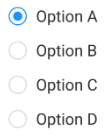

# Selenium WebDriver CSS Selectors

<div class="pt-12">
  <span @click="$slidev.nav.next" class="px-2 py-1 rounded cursor-pointer" hover="bg-white bg-opacity-10">
    Press Space for next page <carbon:arrow-right class="inline"/>
  </span>
</div>

<div class="abs-br m-6 flex gap-2">
  <a href="https://github.com/mhmasum0/qa-june-2024-automation-with-java-slides" target="_blank" alt="GitHub" title="Open in GitHub"
    class="text-xl slidev-icon-btn opacity-50 !border-none !hover:text-white">
    <carbon-logo-github />
  </a>
</div>

<!--
The last comment block of each slide will be treated as slide notes. It will be visible and editable in Presenter Mode along with the slide. [Read more in the docs](https://sli.dev/guide/syntax.html#notes)
-->

---
hideInToc: true
---

# Agenda
<Toc />

---
layout: center
---

# CSS Selectors

> Primarily designed to style elements on a webpage using Cascading Style Sheets (CSS). They can also be used for selecting elements in web scraping and automation contexts.

<br>

## Syntax
>  Generally simpler and more readable syntax. They use a combination of <HL>element tags, IDs, classes, attributes, and pseudo-classes</HL> to target elements.


<br>

# XPath

> Designed for navigating and querying XML documents, including HTML. XPath offers more powerful and complex selection criteria.

---
layout: center
---

# Capabilities

- **CSS Selectors:** Generally faster because they use a simpler approach to find elements.
- **XPath:** Can be slower due to the complexity of parsing expressions and potentially needing to traverse the entire document.

<br>

<HL>Recommendations:</HL> Use CSS selectors whenever possible, and only use XPath when CSS selectors cannot handle the selection criteria.


---
layout: center
---

# Difference between CSS selector and XPath


| Feature      | CSS Selectors                                 | XPath                                                  |
|--------------|-----------------------------------------------|--------------------------------------------------------|
| Purpose      | Styling and selecting elements in HTML        | Navigating and querying XML documents (including HTML) |
| Syntax       | Simpler, more readable                        | More complex, harder to learn                          |
| Capabilities | Limited to attributes (ID, class, etc.)       | Powerful, can target based on position, content, etc.  |
| Performance  | Faster                                        | Slower                                                 |
| Use Cases    | Simpler selection tasks, well-structured HTML | Complex scenarios, specific content/position targeting |


---
layout: center
---

# CSS Selectors Symbols

| Attribute                | Symbol Used                                         |
|--------------------------|-----------------------------------------------------|
| Using id                 | `#` symbol                                          |
| Using class name         | `.` symbol                                          |
| Using attribute          | `tagname[attribute='value']`                        |
| Using multiple attribute | `tagname[attribute1='value1'][attribute2='value2']` |
| Contains                 | `*` symbol                                          |
| Starts with              | `^` symbol                                          |
| Ends with                | `$` symbol                                          |

---
layout: center
---

# CSS Selector: Using ID
Syntax: `tagname#id`

Example:
`input#password`

# CSS Selector: Using Class Name
Syntax: `tagname.classname`

Example: `input.form-control`

---
layout: center
---

# CSS Selector: Using Attribute
Syntax: `tagname[attribute='value']`

Example: `input[name='username']`

# CSS Selector: Using Multiple Attributes
Syntax: `tagname[attribute1='value1'][attribute2='value2']`

Example: `input[name='username'][type='text']`

---

# CSS Selector: Contains, Starts With, Ends With

- **Contains:** `*` symbol
  - `input[id*='user']` matches `input` elements with an `id` attribute containing the text `user`.
- **Starts With:** `^` symbol
  - `input[id^='user']` matches `input` elements with an `id` attribute starting with the text `user`.
- **Ends With:** `$` symbol
    - `input[id$='name']` matches `input` elements with an `id` attribute ending with the text `name`.

<br>

Learn more about CSS Selectors: [CSS Selectors](https://css-tricks.com/css-selectors/)

---
layout: center
---

# Code Example: Radio Button



```java
class RadioButtons {
    public static void main(String[] args) {
        WebDriver driver = new ChromeDriver();
        driver.get("https://qbek.github.io/selenium-exercises/en/");
        driver.manage().window().maximize();

        driver.findElement(By.xpath("//a[@href=\"radio_buttons.html\"]")).click();
        List<WebElement> radio = driver.findElements(By.xpath("//input[@type='radio']"));

        for (WebElement local_radio : radio) {
            String value = local_radio.getAttribute("value");
            System.out.println("Values from radio buttons are  ==>" + value);
            if (value.equalsIgnoreCase("radiozet")) {
                local_radio.click();
            }
        }
    }
}
```

---
layout: center
---

# Code Example: Checkbox

```java
class CheckBox {
    public static void main(String[] args) {
        WebDriver driver = new ChromeDriver();
        driver.get("https://qbek.github.io/selenium-exercises/en/");
        driver.manage().window().maximize();

        driver.findElement(By.xpath("//a[@href=\"check_boxes.html\"]")).click();

        List<WebElement> check = driver.findElements(By.xpath("//input[@type='checkbox']"));

        for (WebElement local_check : check) {
            String name = local_check.getAttribute("name");
            System.out.println("Values from check boxes are  ==>" + name);
            if (name.equalsIgnoreCase("blue")) {
                local_check.click();
            }
        }
    }
}
```

---
src: ../../pages/common/end.md
---