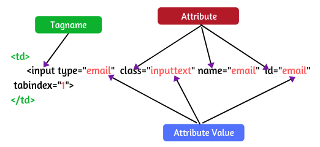
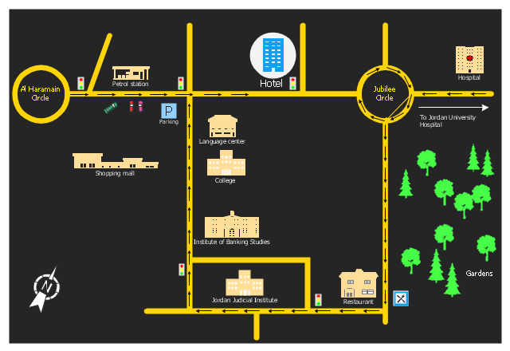

# Selenium WebDriver Locators

  
    Press Space for next page <carbon:arrow-right class="inline"/>
  

  <a href="https://github.com/mhmasum0/qa-june-2024-automation-with-java-slides" target="_blank" alt="GitHub" title="Open in GitHub"
    class="text-xl slidev-icon-btn opacity-50 !border-none !hover:text-white">
    <carbon-logo-github />
  </a>

<!--
The last comment block of each slide will be treated as slide notes. It will be visible and editable in Presenter Mode along with the slide. [Read more in the docs](https://sli.dev/guide/syntax.html#notes)
-->

---
hideInToc: true
---

# Agenda
<Toc />

---
layout: center
---

# Elements on the Web Page

---
layout: center
---

# What is a Locator?

> Locator is a technique to find any element on web page.

---
layout: center
---

# Types of Locators

- ID
- Name
- ClassName
- XPath
- CSS Selector
- PartialLinkText
- LinkText
- TagName

---
layout: center
---

# Dynamic XPath in Selenium

<C>Using single attribute</C>

`//tagname[@attribute-name=’value1’]`

<C>Example</C>

`//a[@href=’http://www.google.com’]`  
`//input[@id=’name’]`  
`//input[@name=’username’]`  
`//img[@alt=’sometext’]`

---
layout: center
---

# Dynamic XPath using multiple attributes

`//tagname[@attribute1=’value1’][attribute2=’value2’]`

<C>Example</C>

`//a[@id=’id1’][@name=’value1’]`  
`//img[@src=’’][@href=’’]`  
`//img[@src=’’ AND @href=’’]`  
`//img[@src=’’ OR @href=’’]`

---

# Dynamic XPath using contains()

> `contains()` is a function in XPath which is used to search for a specified text in the attribute value.

`//tagname[contains(@attribute, ‘value’)]`

<C>Example</C>

`//input[contains(@id,’’)]`  
`//input[contains(@name,’’)]`  
`//a[contains(@href,’’)]`  
`//img[contains(@src,’’)]`

---

# Dynamic XPath using starts-with()

> The XPath `starts-with()` function is used to find the element in which the attribute value starts with some specific character or a sequence of characters.

`//tagname[starts-with(@attribute, ‘value’)]`

<C>Example</C>

`//input[starts-with(@id,’’)]`  
`//input[starts-with(@name,’’)]`  
`//a[starts-with(@href,’’)]`  
`//img[starts-with(@src,’’)]`

---

# Dynamic XPath using text()

> The XPath `text()` function is used to find the element in which the text is present.

`//tagname[text()=’text’]`

<C>Example</C>

`//a[text()=’Google’]`  
`//a[text()=’Gmail’]`  
`//a[text()=’Images’]`  
`//a[text()=’Sign in’]`
`//*[text()=’text’]`

> `*` is used to represent all the elements.

---
src: ../../pages/common/end.md
---