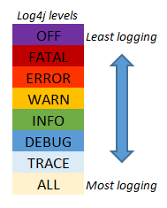

# Log4J

<div class="pt-12">
  <span @click="$slidev.nav.next" class="px-2 py-1 rounded cursor-pointer" hover="bg-white bg-opacity-10">
    Press Space for next page <carbon:arrow-right class="inline"/>
  </span>
</div>

<div class="abs-br m-6 flex gap-2">
  <a href="https://github.com/mhmasum0/qa-june-2024-automation-with-java-slides" target="_blank" alt="GitHub" title="Open in GitHub"
    class="text-xl slidev-icon-btn opacity-50 !border-none !hover:text-white">
    <carbon-logo-github />
  </a>
</div>

<!--
The last comment block of each slide will be treated as slide notes. It will be visible and editable in Presenter Mode along with the slide. [Read more in the docs](https://sli.dev/guide/syntax.html#notes)
-->

---
hideInToc: true
---

# Agenda
<Toc />

---
layout: center
---

# Log4J
> Log4j is a fast, flexible and reliable logging framework written in Java. It is an open-source logging API for Java. It is managed using Apache Software Foundation.

## Purpose and Importance
Logging is essential for tracking events that happen when some software runs. Log4j provides a sophisticated and flexible framework to produce logs in a variety of formats and destinations.

---
layout: center
---

# Adding Log4J to the Project

Link: https://mvnrepository.com/artifact/org.apache.logging.log4j

add the following dependency to the `pom.xml` file.

```xml
<dependency>
    <groupId>org.apache.logging.log4j</groupId>
    <artifactId>log4j-core</artifactId>
    <version>2.24.0</version>
</dependency>
<dependency>
    <groupId>org.apache.logging.log4j</groupId>
    <artifactId>log4j-api</artifactId>
    <version>2.24.0</version>
</dependency>
```
---
layout: center
---

# Log4J Setup and Syntax

Import the following classes in the Java file.

```java
import org.apache.logging.log4j.LogManager;
import org.apache.logging.log4j.Logger;
```

Create a logger object using the following syntax.

```java
private static final Logger logger = LogManager.getLogger(ClassName.class);
```

For logging, use the following syntax.

```java
logger.info("This is an info message");
logger.error("This is an error message");
logger.warn("This is a warning message");
logger.debug("This is a debug message");
```

---
layout: center
---

# Log4J Configuration

Create a `log4j2.properties` file in the `src/test/resources` directory.

```properties
# Set the level of internal Log4j events.
status = error

# Define the configuration name
name = PropertiesConfig

# Console appender configuration
appender.console.type = Console
appender.console.name = ConsoleAppender
appender.console.layout.type = PatternLayout
appender.console.layout.pattern = %d{yyyy-MM-dd HH:mm:ss.SSS} [%t] %-5level %logger{36} - %msg%n

# File appender configuration
appender.file.type = File
appender.file.name = FileAppender
appender.file.fileName = logs/nexxvali_automation_application.log
appender.file.layout.type = PatternLayout
appender.file.layout.pattern = %d{yyyy-MM-dd HH:mm:ss.SSS} [%t] %-5level %logger{36} - %msg%n

# Root logger configuration
rootLogger.level = info
rootLogger.appenderRefs = console, file
rootLogger.appenderRef.console.ref = ConsoleAppender
rootLogger.appenderRef.file.ref = FileAppender
```

---
layout: center
---

# Logging Levels

<HL>ALL < TRACE < DEBUG < INFO < WARN < ERROR < FATAL < OFF</HL>



---
layout: two-cols
zoom: 0.8
---

# Code Example: Log4J

```java
class Log4JExample {
    WebDriver driver;
    private static final Logger log = LogManager.getLogger(Log4JExample.class);
    
    @BeforeMethod
    public void setup() {
        log.info("*************** Application starting ***************");
        driver = new ChromeDriver();
        driver.get("https://www.saucedemo.com/");
        driver.manage().window().maximize();
        log.info("*************** Application started ***************");
    }
    @Test(dataProvider ="sauceLabData")
    public void login(String username, String password) throws InterruptedException {
        driver.findElement(By.id("user-name")).sendKeys(username);
        log.info("Username entered");

        driver.findElement(By.name("password")).sendKeys(password);
        log.info("Password entered");

        driver.findElement(By.className("submit-button")).click();
        log.info("Clicked on login button");
        Thread.sleep(3000);
        String actual = null;
        try {
            actual = driver.findElement(By.xpath("//*[text()='Products']")).getAttribute("innerHTML");
        } catch (Exception e) {
            log.error(e.getMessage());
        }
        Assert.assertEquals(actual, "Products", "Login not Successful. Maybe credentials are wrong.");
    }
```

::right::
```java
@AfterMethod
public void tearDown() {
    log.info("*************** Application closing ***************");
    driver.quit();
    log.info("*************** Application closed ***************");
}

@DataProvider(name = "sauceLabData")
public Object[][] passData() {

    Object[][] data = new Object[0][0];
    try(FileInputStream inputStream = new FileInputStream(new File("SauceLabCredentials.xlsx"))) {
        Workbook workbook = new XSSFWorkbook(inputStream);
        Sheet sheet = workbook.getSheet("Sheet1");

        int rowCount = sheet.getLastRowNum() - sheet.getFirstRowNum();
        data = new Object[rowCount][2];

        for (int i = 1; i <= rowCount; i++) {
            Row row = sheet.getRow(i);
            for (int j = 0; j <2; j++) {
                data[i - 1][j] = row.getCell(j).toString();
            }
        }
    } catch (IOException e) {
        System.out.println(e.getMessage());
    }
    return data;
}
```

---
src: ../../pages/common/end.md
---