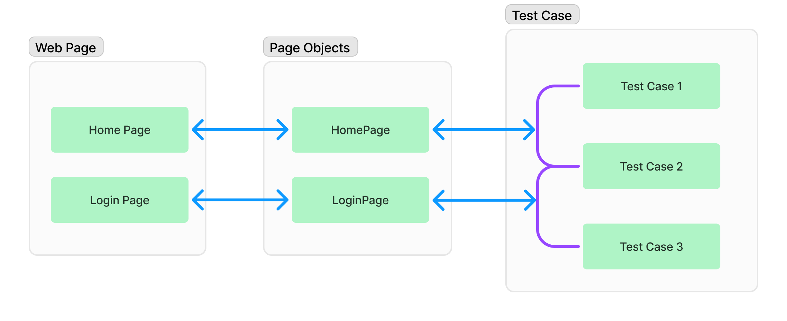
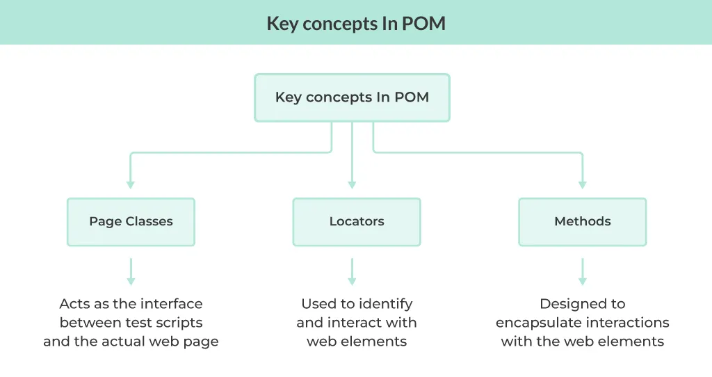

# Page Object Model(POM)

<div class="pt-12">
  <span @click="$slidev.nav.next" class="px-2 py-1 rounded cursor-pointer" hover="bg-white bg-opacity-10">
    Press Space for next page <carbon:arrow-right class="inline"/>
  </span>
</div>

<div class="abs-br m-6 flex gap-2">
  <a href="https://github.com/mhmasum0/qa-june-2024-automation-with-java-slides" target="_blank" alt="GitHub" title="Open in GitHub"
    class="text-xl slidev-icon-btn opacity-50 !border-none !hover:text-white">
    <carbon-logo-github />
  </a>
</div>

<!--
The last comment block of each slide will be treated as slide notes. It will be visible and editable in Presenter Mode along with the slide. [Read more in the docs](https://sli.dev/guide/syntax.html#notes)
-->

---
hideInToc: true
---

# Agenda
<Toc />

---
layout: center
---

# Page Object Model(POM)
> Page Object Model is a design pattern to create Object Repository for web UI elements. Under this model, for each web page in the application, there should be corresponding page class. The page class will find the WebElements of that web page and also contains Page methods which perform operations on those WebElements.

## Why POM?
- Maintainability
- Code Reusability
- Clarity and Readability
- Decoupling Test Logic from UI Logic

---
layout: center
---

# Overview of POM





---
layout: center
---

# Basic Structure of POM

```plaintext
src
├── main
│   └── java
│       └── pages
|           ├── BasePage.java
│           ├── HomePage.java
│           ├── LoginPage.java
│           └── ...
│       └── core
│           ├── Constants.java
│           ├── ResourceStrings.java
│           └── ...
|       └── utils
|           ├── ExcelReader.java
|           ├── ConfigReader.java
|           └── PDFReader.java
└── test
    └── java
        └── tests
            ├── BaseTest.java
            ├── LoginTest.java
            └── HomePageTest.java
            |── ...
```

---
layout: center
---

# BasePage Class

```java
class BasePage {
    protected WebDriver driver;
    private static final Logger logger = LogManager.getLogger(BasePage.class);

    public BasePage(WebDriver driver) {
        this.driver = driver;
    }

    public void sendKeys(WebElement element, String text) {
        element.sendKeys(text);
    }
    
    public void click(WebElement element) {
        element.click();
    }
    
    public String getText(WebElement element) {
        return element.getText();
    }
    
    public void clear(WebElement element) {
        element.clear();
    }
}
```

---
layout: center
---

# HomePage Class

```java
class HomePage extends BasePage {
    private static final Logger logger = LogManager.getLogger(HomePage.class);
    private final By accountButtonLocator = By.id("account");

    public HomePage(WebDriver driver) {
        super(driver);
    }
    
    public void clickAccountButton() {
        WebElement accountButton = driver.findElement(accountButtonLocator);
        logger.info("Clicking on Account Button");
        click(accountButton);
    }
}
```
---
layout: center
---

# BaseTest Class

```java
class BaseTest {
    protected WebDriver driver;
    private static final Logger logger = LogManager.getLogger(BaseTest.class);

    @BeforeMethod
    public void setUp() {
        driver = new ChromeDriver();
        logger.info("Driver is initialized");
        driver.manage().window().maximize();
        driver.get("https://example.com");
        logger.info("Navigated to the URL: https://example.com");
    }

    @AfterMethod
    public void tearDown() {
        driver.quit();
        logger.info("Driver is closed");
    }
}
```

---
layout: center
---

# HomePageTest Class

```java
class HomePageTest extends BaseTest {
    private static final Logger logger = LogManager.getLogger(HomePageTest.class);

    @Test
    public void testHomePage() {
        HomePage homePage = new HomePage(driver);
        homePage.clickAccountButton();
        logger.info("Clicked on Account Button");
    }
}
```

---
src: ../../pages/common/end.md
---