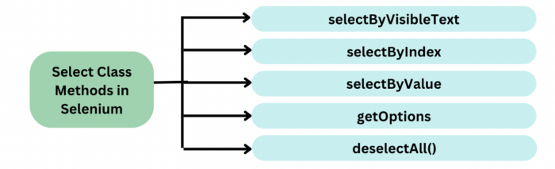

# Selenium WebDriver Select Dropdown

<div class="pt-12">
  <span @click="$slidev.nav.next" class="px-2 py-1 rounded cursor-pointer" hover="bg-white bg-opacity-10">
    Press Space for next page <carbon:arrow-right class="inline"/>
  </span>
</div>

<div class="abs-br m-6 flex gap-2">
  <a href="https://github.com/mhmasum0/qa-june-2024-automation-with-java-slides" target="_blank" alt="GitHub" title="Open in GitHub"
    class="text-xl slidev-icon-btn opacity-50 !border-none !hover:text-white">
    <carbon-logo-github />
  </a>
</div>

<!--
The last comment block of each slide will be treated as slide notes. It will be visible and editable in Presenter Mode along with the slide. [Read more in the docs](https://sli.dev/guide/syntax.html#notes)
-->

---
hideInToc: true
---

# Agenda
<Toc />

---
layout: center
---

# HTML Select Dropdown

```html
<select id="dropdown">
  <option value="1">Option 1</option>
  <option value="2">Option 2</option>
  <option value="3">Option 3</option>
</select>
```

Tree structure of the dropdown:

- **Select**
  - _Option 1_
  - _Option 2_
  - _Option 3_

---
layout: center
---

# Selenium WebDriver Select Dropdown

> **Syntax:** to select dropdown using Selenium WebDriver <br> `Select select = new Select(WebElement webelement);`

 **Methods:**




Learn more about [Select](https://toolsqa.com/selenium-webdriver/dropdown-in-selenium/)

---
layout: center
---

# selectByVisibleText()

<B>Syntax:</B>

```java
obj.Select.selectByVisibleText(“text”);
```

<B>Example:</B>

```java
Select objSelect =new Select(driver.findElement(By.id("search-box")));
objSelect.selectByVisibleText("Automation");
```

---
layout: center
---

# selectByIndex()

<B>Syntax:</B>

```java
obj.Select.selectByIndex(index);
```

<B>Example:</B>

```java
Select objSelect =new Select(driver.findElement(By.id("search-box")));
objSelect.selectByIndex(1);
```

---
layout: center
---

# selectByValue()

<B>Syntax:</B>

```java
obj.Select.selectByValue(“value”);
```

<B>Example:</B>

```java
Select objSelect =new Select(driver.findElement(By.id("search-box")));
objSelect.selectByValue("Automation");
```

---
layout: center
---

# getOptions()

<B>Syntax:</B>

```java
List<WebElement> options = objSelect.getOptions();
```

<B>Example:</B>

```java
Select objSelect =new Select(driver.findElement(By.id("search-box")));
List<WebElement> options = objSelect.getOptions();
System.out.println(options.size());
```

---
layout: center
---

# deselectAll()

<B>Syntax:</B>

```java
objSelect.deselectAll();
```

<B>Example:</B>

```java
Select objSelect =new Select(driver.findElement(By.id("search-box")));
objSelect.deselectAll();
```

---
layout: center
---

# Code Example of Select Dropdown

```java
public class SelectDropdown {
    public static void main(String[] args) {
        WebDriver driver = new ChromeDriver();
        driver.get("https://qbek.github.io/selenium-exercises/en/");

        driver.findElement(By.xpath("//a[@href='selects.html']")).click();

        // Select how many letters
        WebElement selectLetter = driver.findElement( By.cssSelector(".custom-select.mb-3") );

        Select select = new Select( selectLetter );
        select.selectByIndex(2);
    }
}
```


---
src: ../../pages/common/end.md
---