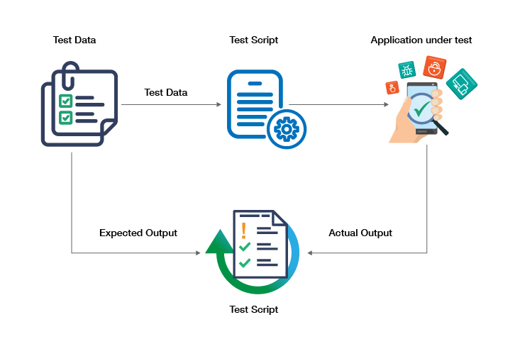

# TestNG Data Driven Testing

<div class="pt-12">
  <span @click="$slidev.nav.next" class="px-2 py-1 rounded cursor-pointer" hover="bg-white bg-opacity-10">
    Press Space for next page <carbon:arrow-right class="inline"/>
  </span>
</div>

<div class="abs-br m-6 flex gap-2">
  <a href="https://github.com/mhmasum0/qa-june-2024-automation-with-java-slides" target="_blank" alt="GitHub" title="Open in GitHub"
    class="text-xl slidev-icon-btn opacity-50 !border-none !hover:text-white">
    <carbon-logo-github />
  </a>
</div>

<!--
The last comment block of each slide will be treated as slide notes. It will be visible and editable in Presenter Mode along with the slide. [Read more in the docs](https://sli.dev/guide/syntax.html#notes)
-->

---
hideInToc: true
---

# Agenda
<Toc />

---
layout: center
---

# TestNG Data Driven Testing

> Data-driven testing is a test design and execution strategy where test scripts read test data from data sources like Excel, CSV, XML, databases, etc. and use it as test input.

- It can be used when one Test Case has to execute with different set of Data

<br><B>Example:</B> Let's say we have 20 credentials and we need to test our application with all credentials so we will be writing only 1 test script and test will be passed via Excel sheet.




---
layout: center
---

# Code Example

```java
class DataDrivenTest {
    
    @Test(dataProvider = "data-provider")
    public void testMethod(String username, String password) {
        System.out.println("Username: " + username + " Password: " + password);
    }

    @DataProvider(name = "data-provider")
    public Object[][] dataProviderMethod() {

        Object[][] data = new Object[3][2];

        data[0][0] = "username1";
        data[0][1] = "password1";
        
        data[1][0] = "username2";
        data[1][1] = "password2";
        
        data[2][0] = "username3";
        data[2][1] = "password3";

        return data;
    }
}
```

---
layout: two-cols
---

# Code Example(Data Driven Testing)

```java
class DataDrivenTest {
    WebDriver driver;
    @BeforeMethod
    public void setup() {
        driver = new ChromeDriver();
        driver.get("https://www.saucedemo.com/");
        driver.manage().window().maximize();
    }
    @Test(dataProvider ="sauceLabData")
    public void login(String username, String password) throws InterruptedException {
        driver.findElement(By.id("user-name")).sendKeys(username);
        driver.findElement(By.name("password")).sendKeys(password);
        driver.findElement(By.className("submit-button")).click();
        Thread.sleep(3000);
        String actual = null;
        try {
            actual = driver.findElement(By.xpath("//*[text()='Products']")).getAttribute("innerHTML");
        } catch (Exception e) {
            System.out.println(e.getMessage());
        }
        Assert.assertEquals(actual, "Products", "Login not Successful. Maybe credentials are wrong.");
    }
    
    
}
```

::right::

```java
@AfterMethod
public void tearDown() {
    driver.quit();
}

@DataProvider(name = "sauceLabData")
public Object[][] passData() {
    Object[][] data = new Object[3][2];
    //1st Set
    data[0][0] = "standard_user";
    data[0][1] = "secret_sauce";
    //2nd Set
    data[1][0] = "problem_user";
    data[1][1] = "secret_sauce";
    //3rd Set
    data[2][0] = "admin2";
    data[2][1] = "demo1234";
    return data;
}
```

---
layout: center
---

# Assertion in TestNG

- TestNG provides a set of assertion methods to validate the actual and expected results.

## Why is Assertion?
- <B>Verification & Validation:</B> Ensures that the code behaves as expected and meets the requirements.

---
layout: center
---

# Code Example: TestNG Assertion

```java
class AssertionTest {
    @Test
    public void testMethod() {
        int actual = 5;
        int expected = 5;
        Object obj1 = null;
        Object obj2 = new Object();
        Object obj3 = obj2;

        Assert.assertEquals(actual, expected, "Actual and expected values are not equal");
        Assert.assertNotEquals(actual, 6, "Actual value is equal to 6");
        Assert.assertTrue(actual == 5, "Actual value is not equal to 5");
        Assert.assertFalse(actual == 6, "Actual value is equal to 6");
        Assert.assertNull(obj1, "Object is not null");
        Assert.assertNotNull(obj2, "Object is null");
        Assert.assertSame(obj2, obj3, "Objects do not point to the same reference");
        Assert.assertNotSame(obj1, obj2, "Objects point to the same reference");
    }
}
```

---
layout: center
---

# Running the Tests using testng.xml

- TestNG allows you to run multiple test classes using a single testng.xml file.

Documentations: [https://testng.org/#_testng_xml](https://testng.org/#_testng_xml)

```xml
<!DOCTYPE suite SYSTEM "https://testng.org/testng-1.0.dtd">
<suite name="Suite1">
    <test name="Test1">
        <classes>
            <class name="TestNGAnnotations"/>
        </classes>
    </test>
</suite>
```


---
layout: center
---

# Apache POI
> Apache POI is a popular API that allows to create, modify, and display MS Office files using Java programs. It is an open-source library developed and distributed by Apache Software Foundation to design or modify Microsoft Office files using Java program.

<br>

## Why Apache POI?
- Read, write and modify Excel files

---
layout: center
---

# Apache POI: Dependency

- POI and POI-OOXML are the two main dependencies for Apache POI.

Maven Repository: [https://mvnrepository.com/search?q=poi](https://mvnrepository.com/search?q=poi)

Add the following dependencies in your `pom.xml` file:

```xml
<dependency>
    <groupId>org.apache.poi</groupId>
    <artifactId>poi</artifactId>
    <version>5.3.0</version>
</dependency>

<dependency>
    <groupId>org.apache.poi</groupId>
    <artifactId>poi-ooxml</artifactId>
    <version>5.3.0</version>
</dependency>
```

---
layout: center
---

# Code Example: Read Excel File

```java
class ReadExcelFile {
    public static void main(String[] args) throws IOException {
        File src = new File("SauceLabCredentials.xlsx");

        FileInputStream fileInputStream = new FileInputStream(src);
        XSSFWorkbook workbook = new XSSFWorkbook(fileInputStream);

        Sheet sheet = workbook.getSheet("Sheet1");

        String data0 = sheet.getRow(1).getCell(0).getStringCellValue();
        System.out.println("Data from Excel is " + data0);

        String data1 = sheet.getRow(2).getCell(0).getStringCellValue();
        System.out.println("Data from Excel is " + data1);

        workbook.close();
        fileInputStream.close();
    }
}
```

---
layout: two-cols
---

# Code Example: Load Data from Excel

```java
public class DataDrivenTest {
    WebDriver driver;
    @BeforeMethod
    public void setup() {
        driver = new ChromeDriver();
        driver.get("https://www.saucedemo.com/");
        driver.manage().window().maximize();
    }
    @Test(dataProvider = "sauceLabData")
    public void login(String username, String password) throws InterruptedException {
        driver.findElement(By.id("user-name")).sendKeys(username);
        driver.findElement(By.name("password")).sendKeys(password);
        driver.findElement(By.className("submit-button")).click();
        Thread.sleep(3000);
        String actual = null;
        try {
            actual = driver.findElement(By.xpath("//*[text()='Products']")).getAttribute("innerHTML");
        } catch (Exception e) {
            System.out.println(e.getMessage());
        }
        Assert.assertEquals(actual, "Products", "Login not Successful. Maybe credentials are wrong.");
    }
}
```
::right::

```java
@AfterMethod
public void tearDown() {
    driver.quit();
}
@DataProvider(name = "sauceLabData")
    public Object[][] passData() throws IOException {
        Object[][] data = new Object[0][0];
        try(FileInputStream inputStream = new FileInputStream(new File("SauceLabCredentials.xlsx"))) {
            Workbook workbook = new XSSFWorkbook(inputStream);
            Sheet sheet = workbook.getSheet("Sheet1");

            int rowCount = sheet.getLastRowNum() - sheet.getFirstRowNum();
            data = new Object[rowCount][2];

            for (int i = 1; i <= rowCount; i++) {
                Row row = sheet.getRow(i);
                for (int j = 0; j <2; j++) {
                    data[i - 1][j] = row.getCell(j).toString();
                }
            }
        } catch (IOException e) {
            System.out.println(e.getMessage());
        }
        return data;
    }
```

---
src: ../../pages/common/end.md
---