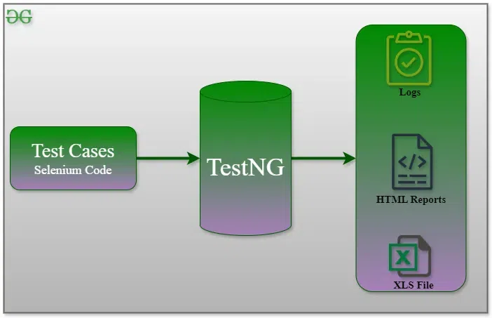
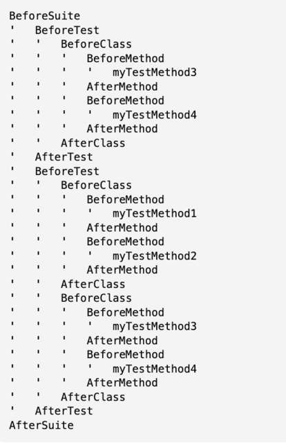

# TestNG Framework Fundamentals

<div class="pt-12">
  <span @click="$slidev.nav.next" class="px-2 py-1 rounded cursor-pointer" hover="bg-white bg-opacity-10">
    Press Space for next page <carbon:arrow-right class="inline"/>
  </span>
</div>

<div class="abs-br m-6 flex gap-2">
  <a href="https://github.com/mhmasum0/qa-june-2024-automation-with-java-slides" target="_blank" alt="GitHub" title="Open in GitHub"
    class="text-xl slidev-icon-btn opacity-50 !border-none !hover:text-white">
    <carbon-logo-github />
  </a>
</div>

<!--
The last comment block of each slide will be treated as slide notes. It will be visible and editable in Presenter Mode along with the slide. [Read more in the docs](https://sli.dev/guide/syntax.html#notes)
-->

---
hideInToc: true
---

# Agenda
<Toc />

---
layout: center
---

# What is TestNG?

> TestNG(Test Next Generation) is a testing framework inspired from JUnit and NUnit but introducing some new functionalities that make it more powerful and easier to use.

Official Website: [testng.org](https://testng.org/)



---

# Why TestNG?

- TestNG is designed to cover all categories of tests: unit, functional, end-to-end, integration, etc.
- **Advanced annotations:** More powerful and flexible annotations.
- **Grouping and Prioritizing:** TestNG allows you to group test cases and prioritize
- **Dependency Testing:** TestNG allows you to define dependencies between test methods.
- **Data-Driven Testing:** TestNG allows you to run the same test case with different data sets.
- **Parallel Testing:** TestNG allows you to run test cases in parallel.
- **Reporting:** TestNG provides detailed reports of test execution.

---
layout: two-cols
---

# TestNG Annotations

- **@BeforeSuite:**
- **@AfterSuite:**
- **@BeforeTest:**
- **@AfterTest:**
- **@BeforeGroups:**
- **@AfterGroups:**
- **@BeforeClass:**
- **@AfterClass:**
- **@BeforeMethod:**
- **@AfterMethod:**

::right::

# Java Annotations Syntax
- **Marker Annotations:** `@Test`
- **Single-Value Annotations:** `@Test(priority = 1)`
- **Multi-Value Annotations:** `@Test(priority = 1, enabled = true)`

---
layout: center
---

# TestNG Annotations hierarchy



---
layout: center
zoom: 0.65
---

# Code Example: TestNG Annotations

```java
class TestNGAnnotations {
    @BeforeSuite
    public void beforeSuite() {
        System.out.println("Before Suite");
    }
    @BeforeTest
    public void beforeTest() {
        System.out.println("Before Test");
    }
    @BeforeClass
    public void beforeClass() {
        System.out.println("Before Class");
    }
    @BeforeMethod
    public void beforeMethod() {
        System.out.println("Before Method");
    }
    @Test
    public void test1() {
        System.out.println("Test 1");
    }
    @Test
    public void test2() {
        System.out.println("Test 2");
    }
    @AfterMethod
    public void afterMethod() {
        System.out.println("After Method");
    }
    @AfterClass
    public void afterClass() {
        System.out.println("After Class");
    }
    @AfterTest
    public void afterTest() {
        System.out.println("After Test");
    }
    @AfterSuite
    public void afterSuite() {
        System.out.println("After Suite");
    }
}
```

---
layout: center
---

# Dependent Test

- `@Test(dependsOnMethods = {"methodName"} )`
- `@Test(dependsOnGroups = {"groupName"} )`

---
layout: two-cols
---

# Code Example: Dependent Test - Method

```java
class DependentTest {
    @Test
    public void login() {
        System.out.println("Login");
    }
    @Test(dependsOnMethods = {"login"})
    public void search() {
        System.out.println("Search");
    }
    @Test(dependsOnMethods = {"search"})
    public void logout() {
        System.out.println("Logout");
    }
}
```

::right::

# Dependent Test - Group

```java
class DependentTest {
    @Test(groups = {"login"})
    public void login() {
        System.out.println("Login");
    }
    @Test(groups = {"search"}, dependsOnGroups = {"login"})
    public void search() {
        System.out.println("Search");
    }
    @Test(dependsOnGroups = {"search"})
    public void logout() {
        System.out.println("Logout");
    }
}
```

---
layout: center
---

# Always Run Test
 > If set to true, this test method will always be run even if it depends on a method that failed.

- **Syntax:** `@Test(alwaysRun = true)`

```java
class AlwaysRunTest {
    @Test
    public void login() {
        System.out.println("Login");
    }
    @Test(dependsOnMethods = {"login"})
    public void search() {
        int a = 10/0;
    }
    @Test(dependsOnMethods = {"search"}, alwaysRun = true)
    public void logout() {
        System.out.println("Logout");
    }
}
```


---
layout: center
---

# Exception Handling in TestNG

- `@Test(expectedExceptions = {Exception.class})`

```java
class ExceptionHandling {
    @Test(expectedExceptions = {ArithmeticException.class})
    public void test() {
        int a = 10/0;
    }
}
```
---
layout: center
---

# Priority in TestNG

> The priority for this test method. Lower priorities will be scheduled first.

- **Syntax:** `@Test(priority = 1)`

```java
class PriorityTest {
    @Test(priority = 1)
    public void test1() {
        System.out.println("Test 1");
    }
    @Test(priority = 2)
    public void test2() {
        System.out.println("Test 2");
    }
}
```


---
src: ../../pages/common/end.md
---