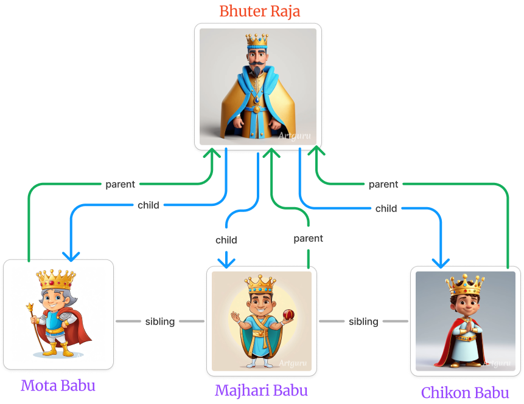
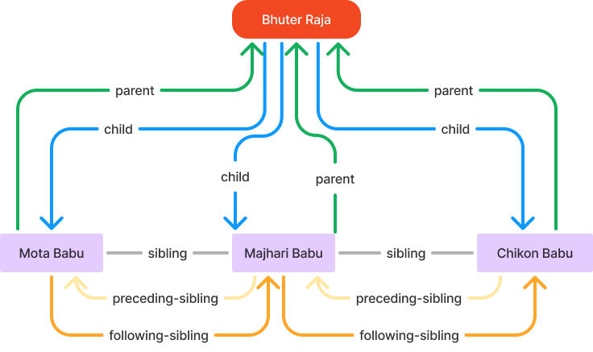
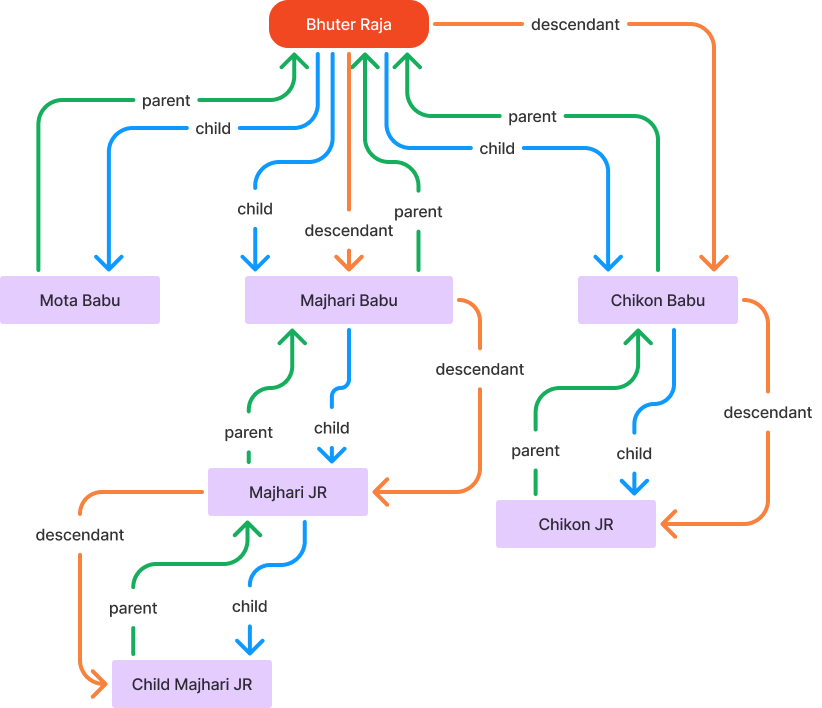
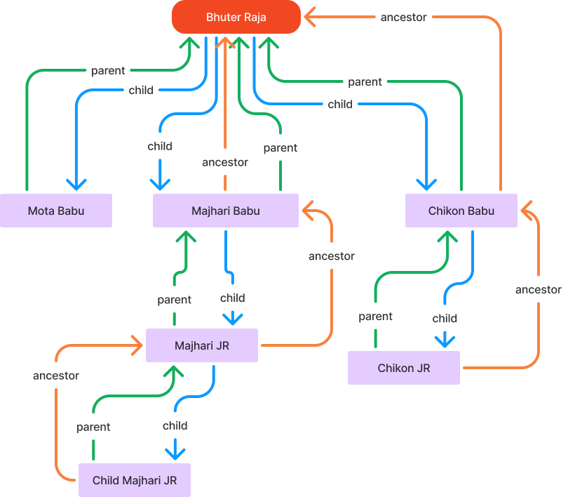

# XPATH Axes

<div class="pt-12">
  <span @click="$slidev.nav.next" class="px-2 py-1 rounded cursor-pointer" hover="bg-white bg-opacity-10">
    Press Space for next page <carbon:arrow-right class="inline"/>
  </span>
</div>

<div class="abs-br m-6 flex gap-2">
  <a href="https://github.com/mhmasum0/qa-june-2024-automation-with-java-slides" target="_blank" alt="GitHub" title="Open in GitHub"
    class="text-xl slidev-icon-btn opacity-50 !border-none !hover:text-white">
    <carbon-logo-github />
  </a>
</div>

<!--
The last comment block of each slide will be treated as slide notes. It will be visible and editable in Presenter Mode along with the slide. [Read more in the docs](https://sli.dev/guide/syntax.html#notes)
-->

---
hideInToc: true
---

# Agenda
<Toc />


---
layout: center
---

# Use Cases




---
layout: center
---

# XPATH Axes: Parent, Child and Sibling



---
layout: center
---

# XPATH Axes: Parent, Child and Sibling (Markup)


This is the website where you can practice XPATH.

Link: [http://xpather.com/](http://xpather.com/)

```html
<bhuter-raja>
  <mota-babu>Mota babu</mota-babu>
  <majhari-babu>majhari babu</majhari-babu>
  <chikon-babu>chikon babu</chikon-babu>
</bhuter-raja>
```

---
layout: center
---

# XPATH Axes: Descendant

> Descendant refers to any node that has a child, grandchild, great-grandchild, and so on.



---
layout: center
---

# XPATH Axes: Ancestor

> Ancestor refers to any node that hase a parent, grandparent, great-grandparent, and so on.



---
layout: center
---

# XPATH Axes: Descendant and Ancestor (Markup)

Link: [http://xpather.com/V68qCwVG](http://xpather.com/V68qCwVG)

```html
<bhuter-raja>
  <mota-babu>Mota babu</mota-babu>
  <majhari-babu>
    majhari babu
    <majhari-jr>
      majhari jr
      <child-majhari-jr>child majhari jr</child-majhari-jr>
    </majhari-jr>
  </majhari-babu>
  <chikon-babu>
    chikon babu
    <chikon-jr>chikon jr</chikon-jr>
  </chikon-babu>
</bhuter-raja>
```

---
src: ../../pages/common/end.md
---