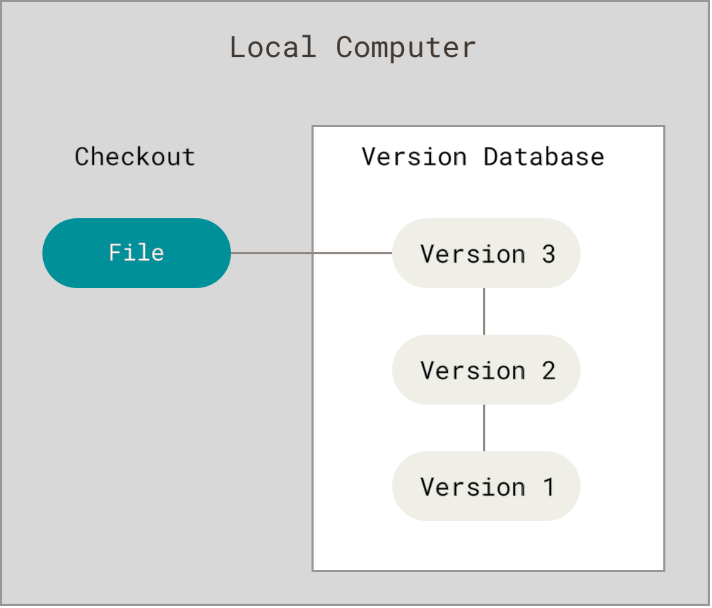
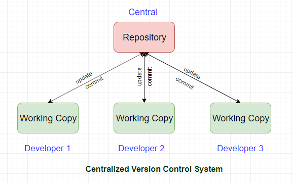
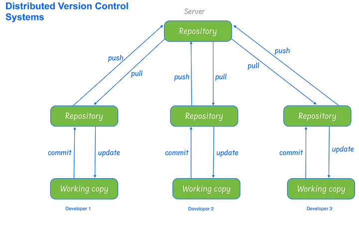
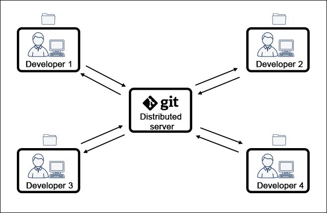
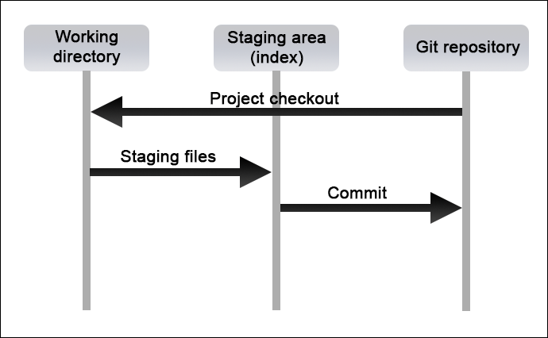

# Version Control with Git

  
    Press Space for next page <carbon:arrow-right class="inline"/>
  

  <a href="https://github.com/mhmasum0/qa-june-2024-automation-with-java-slides" target="_blank" alt="GitHub" title="Open in GitHub"
    class="text-xl slidev-icon-btn opacity-50 !border-none !hover:text-white">
    <carbon-logo-github />
  </a>

<!--
The last comment block of each slide will be treated as slide notes. It will be visible and editable in Presenter Mode along with the slide. [Read more in the docs](https://sli.dev/guide/syntax.html#notes)
-->

---
hideInToc: true
---

# Agenda
<Toc />

---
layout: center
---

# Version Control

> Version Control known as source control, is the practice of tracking and managing changes to software code.

 <B>Local Version Control:</B>

 

---
layout: center
---

# Centralized Version Control

> Centralized Version Control System (CVCS) uses a central server to store all files and enables team collaboration.

---
layout: center
---

# Distributed Version Control

> Distributed Version Control System (DVCS) allows clients to create mirrored repositories. These data backups can be easily be placed on the server to replace any lost information.

 

---
layout: center
---

# Git

> Git is a distributed version control system that is widely used for source code management.

 

---
layout: center
---

# How Git Works

> Git stores data as snapshots of the project over time. It uses a three-stage approach to manage the project.
> - Working Directory
> - Staging Area
> - Repository

 

---
layout: center
---

# Install Git

- Download Git from [git-scm.com](https://git-scm.com/)
- Check the installation by running `git --version`

---
layout: center
---

# Configure Git

> Set your name and email address to identify your commits.

 

- `git config --list --show-origin` to list all configurations
- `git config --global user.name "Your Name"`
- `git config --global user.email johndoe@example.com`

---
layout: center
---

# Create a Git Repository

> Create a new Git repository or clone an existing one.

 

- `git init` to create a new repository
- `git clone <url>` to clone an existing repository

---
layout: center
---

# Git Commands

- `git status` to check the status of the repository
- `git add <file>` to add files to the staging area
- `git commit -m "Message"` to commit changes
- `git diff` to show changes between commits
- `git push` to push changes to the remote repository
- `git pull` to pull changes from the remote repository
- `git log` to show commit history
- `git branch` to list branches
- `git branch <branch>` to create a new branch
- `git checkout <branch>` to switch branches
- `git merge <branch>` to merge branches
- `git remote -v` to show remote repositories

Cheatsheet: [Atlassian Git Cheatsheet](https://www.atlassian.com/git/tutorials/atlassian-git-cheatsheet)

---
layout: center
---

# Git Ignore

> Create a `.gitignore` file to exclude files and directories from being tracked by Git.

---
layout: center
---

# Git != GitHub

> Git is a version control system, while GitHub is a remote repository hosting service.

---
layout: center
---

# Create a GitHub Repository

- Create a new repository on GitHub
- `git remote add origin <repository-url>` to add a remote repository
- `git remote -v` to verify the remote repository
- `git push -u origin main` to push changes to the remote repository

---
layout: center
---
# Set Up SSH Key to GitHub

- Generate a new SSH key
- `ssh-keygen -t rsa -b 4096 -C "your_email@example.com"`
- Add the SSH public key to GitHub from `~/.ssh/id_rsa.pub` or `/c/Users/username/.ssh/id_rsa.pub` file

---
layout: center
---

# Git Branching

> Branching allows you to work on different features or bug fixes without affecting the main codebase.

- `git branch` to list branches
- `git branch <branch>` to create a new branch
- `git checkout <branch>` to switch branches
- `git merge <branch>` to merge branches

---
layout: center
---

# Collaborate on GitHub

---
layout: center
---

# Resources

- [Git Bookdown](https://gitbookdown.dallasdatascience.com/index.html)

---
src: ../../pages/common/end.md
---